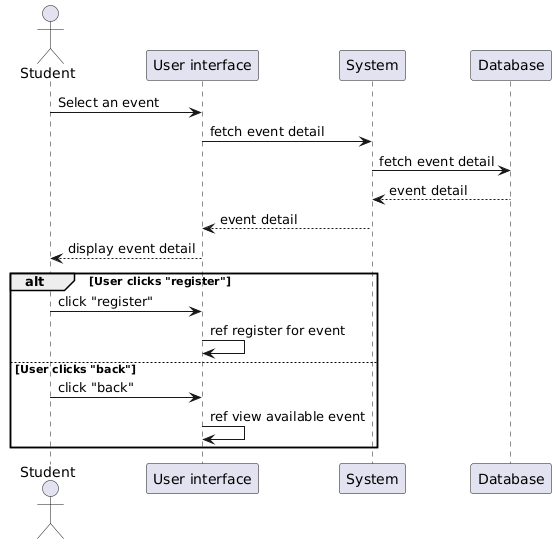
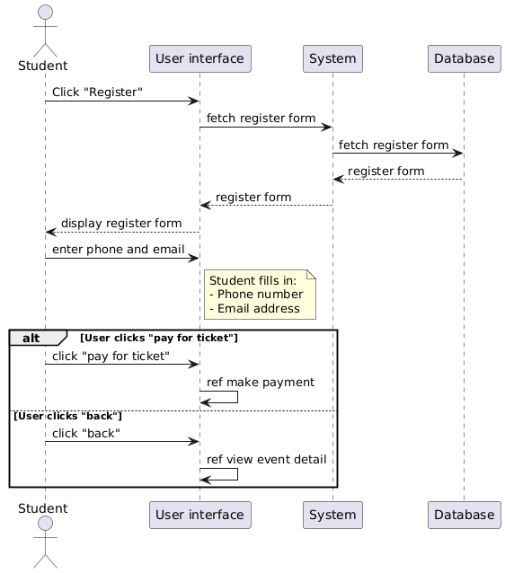
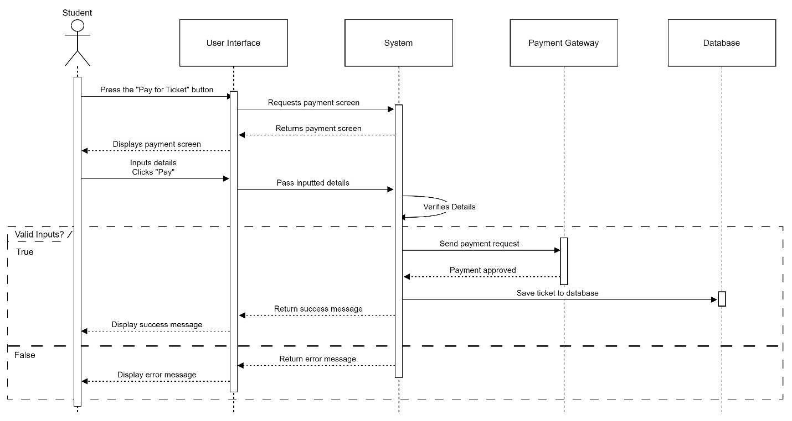
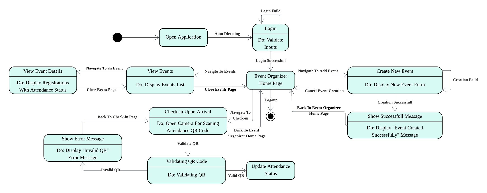

CSE6224-SOFTWARE REQUIREMENTS ENG Assignment (35%)

Title: Campus Event Check-in System

Prepared By:

|   **ID**   |              **Name**               | **Contribution** |
|:----------:|:-----------------------------------:|:----------------:|
| 1211305566 |    ALKATHERI, SULAIMAN ALI MAHDI    |       25%        |
| 1221101391 |             LIM AI NEE              |       25%        |
| 1221100800 | MUHAMMAD AZHAR BIN AHMAD ROSEHAIZAT |       25%        |
| 1211103488 |    YOUSEF ELSAYED EZZAT ELSAYED     |       25%        |

Group: 1 TT1L

Supervision By:

Dr. Zarina Binti Che Embi
([zarina.embi@mmu.edu.my](mailto:wan.noorshahida.isa@mmu.edu.my))

**Table of Contents**

- [List of Figures](#list-of-figures)
- [List of Tables](#list-of-tables)

- [1. Introduction](#introduction)
  - [1.1 Purpose](#purpose)
  - [1.2 Scope](#scope)
  - [1.3 Product Perspective](#product-perspective)
    - [1.3.1 System Interface](#system-interface)
    - [1.3.2 User Interface](#user-interface)
    - [1.3.3 Hardware Interface](#hardware-interface)
    - [1.3.4 Software Interface](#software-interface)
    - [1.3.5 Communication Interface](#communication-interface)
  - [1.4 Product Functions](#product-functions)
  - [1.5 User Characteristics](#user-characteristics)
  - [1.6 Limitations](#limitations)
  - [1.7 Assumptions and Dependencies](#assumptions-and-dependencies)
  - [1.8 Definitions](#definitions)

- [2. Requirements](#requirements)
  - [2.1 External Interfaces](#external-interfaces)
    - [2.1.1 Login User Interface](#login-user-interface)
    - [2.1.2 View Upcoming Events Interface](#view-upcoming-events-interface)
    - [2.1.3 Event Details](#event-details)
    - [2.1.4 Register for Event](#register-for-event)
    - [2.1.5 Make Payment](#make-payment)
    - [2.1.6 Receive e-ticket/QR code](#receive-e-ticketqr-code)
    - [2.1.7 View Registration History](#view-registration-history)
    - [2.1.8 Show QR Attendance](#show-qr-attendance)
    - [2.1.9 Set Event Details](#set-event-details)
    - [2.1.10 View Events (Organizer)](#view-events-organizer)
    - [2.1.11 View Registrations and Attendance Status](#view-registrations-and-attendance-status)
  - [2.2 Functions](#functions)
    - [2.2.1 F00 View Upcoming Events](#f00-view-upcoming-events)
    - [2.2.2 F01 View Event Details](#f01-view-event-details)
    - [2.2.3 F02 Register for Event](#f02-register-for-event)
    - [2.2.4 F03 Make Payment](#f03-make-payment)
    - [2.2.5 F04 Receive e-Ticket/QR Code](#f04-receive-e-ticketqr-code)
    - [2.2.6 F05 View Registration History](#f05-view-registration-history)
    - [2.2.7 F06 Show QR Attendance](#f06-show-qr-attendance)
    - [2.2.8 F07 Create a New Event & F08 Set Event Details](#f07-create-a-new-event--f08-set-event-details)
    - [2.2.9 F09 View Events](#f09-view-events)
    - [2.2.10 F10 View Registrations & Attendance Status](#f10-view-registrations--attendance-status)
    - [2.2.11 F11 Check-in Upon Arrival](#f11-check-in-upon-arrival)
    - [2.2.12 F12 Login](#f12-login)
  - [2.3 State Transition Diagrams](#state-transition-diagrams)
  - [2.4 Performance Requirements](#performance-requirements)
  - [2.5 Security Requirements](#security-requirements)
  - [2.6 Usability Requirements](#usability-requirements)
  - [2.7 Logical Database Requirements](#logical-database-requirements)
    - [2.7.1 Event Table](#event-table)
    - [2.7.2 Registration Table](#registration-table)
    - [2.7.3 Payment Table](#payment-table)
  - [2.8 Design Constraints](#design-constraints)
  - [2.9 Software System Attributes](#software-system-attributes)
  - [2.10 Supporting Information](#supporting-information)
    - [2.10.1 Interview](#interview)
    - [2.10.2 Questionnaires](#questionnaires)
    - [2.10.3 Observation](#observation)

- [3. Verification](#verification)
  - [3.1 Inspection](#inspection)
  - [3.2 Walkthroughs](#walkthroughs)
  - [3.3 Prototyping](#prototyping)

- [4. Appendices](#appendices)
- [5. References](#references)

# 1 Introduction

## 1.1 Purpose

The purpose of the project is to develop a digital check-in platform for
campus events that seamlessly integrates with the university's student
identification database and payment system.  
The system aims to automate and streamline the process of event
attendance tracking, ticket verification, and on-site transactions,
ensuring an efficient, secure, and user-friendly experience for students
and event organizers.

Integration of these components will enable real-time monitoring of
attendance records and payments, reducing administrative burdens and
enhancing overall event management capabilities within the campus
environment.

## 1.2 Scope 

Campus Event Check-in System with Student ID and Payment Integration is
created in order to streamline the process of campus event attendance
tracking, ticket verification, and payment processing for students and
event organizers.

Campus Event Check-in System shall facilitate the following operations:

1.  Check-in to campus events using student ID verification.

2.  Verify event tickets digitally.

3.  Process on-site payments through integrated payment gateways.

4.  Provide real-time attendance and transaction records to event
    organizers.

## 1.3 Product Perspective

The Campus Event Check-in System is an integrated digital platform that
operates as an extension of the university's event management and
student information infrastructure. It interacts with the university's
student database to authenticate users and with a payment gateway to
process event-related transactions. The system supports two main user
roles: students and event organizers. Students use the system to browse
available events, register, make payments, and check in using QR code.
Organizers create events, manage attendee data, and monitor attendance
status. **Figure 1.3.1** shows the overview diagram of the system and
**Figure 1.3.2** shows the context diagram of the system

<figure>

<figcaption>
Figure 1.3.1 System Overview Diagram
</figcaption>
</figure>

<figure>

<figcaption>
Figure 1.3.2 System Context Diagram
</figcaption>
</figure>

## 1.4 Product Functions

**Table 1.4. 1** shows an overview of the core features to be
implemented in the Campus Event Check-in System. Each feature is
identified by a unique ID and includes a brief description along with
the user roles that can access it.

| **Feature ID** | **Feature** | **Description** | **Accessible Roles** |
|----|----|----|----|
| REQ_F00 | View Upcoming Events | Displays a list of upcoming events open for registration. | Student |
| REQ_F01 | View Event Detail | Provides detailed information about a selected event. | Student |
| REQ_F02 | Register for Event | Enables students to register for a selected event. | Student |
| REQ_F03 | Make Payment | Allows students to pay for event tickets. | Student |
| REQ_F04 | Received e-Ticket/QR Code | Generates a unique QR code for the student after successful registration and payment for event check-in and verification. | Student (System) |
| REQ_F05 | View Registration History | Shows a history of past registered events. | Student |
| REQ_F06 | Show QR Attendance for Event | Displays the QR code used for scanning during check-in. | Student |
| REQ_F07 | Create New Event | Allows organizers to create a new event. | Event Organizer |
| REQ_F08 | View Events | Displays a list of events created by the organizer. | Event Organizer |
| REQ_F10 | View Registrations with Attendance Status | Allow organizers to view the list of registered attendees along with real-time updates on their attendance status. | Event Organizer |
| REQ_F11 | Check-in Upon Arrival | Allow organizers to scan the student’s unique QR code using a mobile device to verify attendance. | Event Organizer |
| REQ_F12 | Login | Allows users to securely log into the system. | Student, Event Organizer |

Table 1.4.1 Campus Event
Check-in System Function Table

In terms of diagrams, the use case diagram in **Figure 1.4.1.1** shows
the product functions but in visual format following UML Use Case
Diagram notation.

<figure>

<figcaption>
Figure 1.4.1.1 Campus Event Check-in System Use Case
Diagram
</figcaption>
</figure>

## **1.5 User Characteristics**

This section describes the end users of the Campus Event Check-in System
and their expected level of knowledge. These characteristics help
determine how the system should be designed for usability and
accessibility. **Table 1.5.1** summarizes the intended users and their
required understanding of the system.

| **Role** | **Description** | **Expected Knowledge** |
|:---|----|----|
| **Student** | University students who will use the system to view events, register, make payments, and check in. | Basic understanding of web browsing, online form usage, and scanning QR codes. |
| **Event Organizer** | Authorized university staff or student committees managing events, registrations, and check-ins. | Familiarity with web forms, participant tracking, and scanning devices for check-in. |

Table 1.5.1 Intended Users
and Expected Knowledge

## 1.6 Limitations

Several limitations may affect the design, development, and usage of the
system. These limitations must be considered to ensure that the system
remains secure, scalable, and compliant.

- The system must comply with regional data protection laws to protect
  student privacy.

- Compatibility with assistive technologies (such as screen readers) is
  required for accessibility.

- Support for multiple languages may be needed in the future to cater to
  a diverse user base.

- The system must include secure login procedures and encryption for
  data in transit and at rest.

- User authentication must be robust to prevent unauthorized access.

- Measures must be in place to ensure data integrity and prevent
  corruption or loss.

- The system should be scalable to support growing numbers of users and
  data without performance loss.

- Key features must remain responsive, especially for time-sensitive
  operations like check-in.

- Regular system maintenance is required to address bugs,
  vulnerabilities, and browser compatibility.

- Compatibility issues may occur when integrated platforms are updated.

- Training resources and user documentation should be available to
  support users with limited technical expertise.

## Assumptions and Dependencies

> The development and deployment of the system are based on the
> following assumptions and dependencies:

- The university will provide access to its student information database
  for identity verification.

- A secure and reliable internet connection is available at event
  locations.

- Third-party services like payment gateway APIs will remain stable and
  available.

- Users (students and organizers) will have access to compatible
  browsers and devices.

- The university will assign responsible personnel for ongoing
  maintenance and updates.

- External systems used for integration (student database, payment
  gateway) must maintain backward compatibility.

## 1.7 Definitions

**Table 1.7.1** describes are terminology, phrases, and words utilized
in the document and their corresponding definitions as employed in this
document.

| **Terms, Acronyms and Word** | **Definition** |
|----|----|
| Campus Event Check-in System | The proposed web-based application to manage student event participation, registration, and attendance. |
| Student | A university-registered individual who can register and check in to events. |
| Event Organizer | A staff or authorized user responsible for creating events and managing check-ins. |
| QR Code | A unique code generated after registration used to check in at the event venue. |
| Payment Gateway | A third-party service used to process online event payments securely. |
| Check-in | The process of confirming a student’s attendance using their ID or QR code. |
| REST API | An interface using HTTP methods for client-server communication in the system. |

Table 1.7.1 Glossary of
Terms for the Campus Event Check-in System

# 3 Requirements

Requirements are the functionalities, behaviors, qualities, and
constraints that the final system must fulfill. This chapter outlines
the functional and non-functional requirements necessary for the
successful implementation of the Campus Event Check-in System. Each
requirement is described in detail, and diagrams are provided when
necessary to illustrate system behavior, user interactions, and data
flows. This section also includes any supporting information that aids
in understanding or validating the system’s expected operations and
performance.

## 3.1 Functions

This section outlines the functional requirements that the system is
expected to fulfill upon completion. Each requirement will be explained
in detail and illustrated with a sequence diagram to enhance
understanding.

### 3.1.1 F00 View Upcoming Events 

**Table 3.1.1.1** describes the view upcoming events function and its
description. While **Table 3.1.1.2**  shows the view upcoming events use
case specification table. And **Figure 3.1.1.1** depicts the sequence
diagram for the view upcoming events function.

<table>
<caption>
Table 3.1.1.1
REQ_F0001 Table
</caption>
<colgroup>
<col style="width: 24%" />
<col style="width: 18%" />
<col style="width: 18%" />
<col style="width: 38%" />
</colgroup>
<thead>
<tr>
<th><strong>Requirement ID</strong></th>
<th style="text-align: left;">REQ_F0001</th>
<th><strong>Version</strong></th>
<th><strong>1.0</strong></th>
</tr>
</thead>
<tbody>
<tr>
<td><strong>Item</strong></td>
<td colspan="3">When user clicks on the button, the system shall display
the relevant event’s details</td>
</tr>
<tr>
<td><strong>Item Description</strong></td>
<td colspan="3">Lim Ai Nee</td>
</tr>
</tbody>
</table>

<table>
<caption>
Table 3.1.1.2
F00 View Available Events Use Case Specification Table
</caption>
<colgroup>
<col style="width: 23%" />
<col style="width: 34%" />
<col style="width: 17%" />
<col style="width: 24%" />
</colgroup>
<thead>
<tr>
<th><strong>Feature</strong></th>
<th>F00 View Upcoming Events</th>
<th><strong>Version</strong></th>
<th>1.0</th>
</tr>
</thead>
<tbody>
<tr>
<td><strong>Purpose</strong></td>
<td colspan="3">To allow user to have a quick glance and check out for
upcoming and happening events</td>
</tr>
<tr>
<td><strong>Actor</strong></td>
<td colspan="3">Student</td>
</tr>
<tr>
<td><strong>Precondition</strong></td>
<td colspan="3">An event is created in the system</td>
</tr>
<tr>
<td><strong>Postcondition</strong></td>
<td colspan="3">The details of selected event will be displayed</td>
</tr>
<tr>
<td><strong>Main Flow</strong></td>
<td colspan="3"><ol type="1">
<li>
The System display a list of events
</li>
<li>
The Student scrolls to view multiple events
</li>
</ol></td>
</tr>
<tr>
<td><strong>Alternate Scenario</strong></td>
<td colspan="3" style="text-align: left;">None</td>
</tr>
<tr>
<td><strong>Author</strong></td>
<td colspan="3">Lim Ai Nee</td>
</tr>
</tbody>
</table>

<figure>

<figcaption>
Figure
3.1.1.1 F00 View Upcoming Events Sequence Diagram
</figcaption>
</figure>

### 3.1.2 F01 View Event Details

**Table 3.1.2.1& Table 3.1.2.2**    describe the view event details
function and its description. While **Table 3.1.2.3** shows the view
event details use case specification table. And **Figure 3.1.2.1**
depicts the sequence diagram for the view event details function.

<table>
<caption>
Table 3.1.2.1
REQ_F0101 Table
</caption>
<colgroup>
<col style="width: 24%" />
<col style="width: 18%" />
<col style="width: 18%" />
<col style="width: 38%" />
</colgroup>
<thead>
<tr>
<th><strong>Requirement ID</strong></th>
<th style="text-align: left;">REQ_F0101</th>
<th><strong>Version</strong></th>
<th><strong>1.0</strong></th>
</tr>
</thead>
<tbody>
<tr>
<td><strong>Item</strong></td>
<td colspan="3">The system shall display all the event details entered
by the event organizer</td>
</tr>
<tr>
<td><strong>Author</strong></td>
<td colspan="3">Lim Ai Nee</td>
</tr>
</tbody>
</table>

<table>
<caption>
Table 3.1.2.2
REQ_F0102 Table
</caption>
<colgroup>
<col style="width: 24%" />
<col style="width: 18%" />
<col style="width: 18%" />
<col style="width: 38%" />
</colgroup>
<thead>
<tr>
<th><strong>Requirement ID</strong></th>
<th style="text-align: left;">REQ_F0102</th>
<th><strong>Version</strong></th>
<th><strong>1.0</strong></th>
</tr>
</thead>
<tbody>
<tr>
<td><strong>Item</strong></td>
<td colspan="3">When user clicks on the “Register” button, the system
shall display the registration page that requires user to fill up all
the fields</td>
</tr>
<tr>
<td><strong>Author</strong></td>
<td colspan="3">Lim Ai Nee</td>
</tr>
</tbody>
</table>

<table>
<caption>
Table 3.1.2.3
F01 View Event Details Use Case Specification Table
</caption>
<colgroup>
<col style="width: 23%" />
<col style="width: 34%" />
<col style="width: 17%" />
<col style="width: 24%" />
</colgroup>
<thead>
<tr>
<th><strong>Feature</strong></th>
<th>F01 View Event Details</th>
<th><strong>Version</strong></th>
<th>1.0</th>
</tr>
</thead>
<tbody>
<tr>
<td><strong>Purpose</strong></td>
<td colspan="3">To allow the user to view the event details like
location, time, ticket price and others and to allow the user to
register in the event</td>
</tr>
<tr>
<td><strong>Actor</strong></td>
<td colspan="3">Student</td>
</tr>
<tr>
<td><strong>Precondition</strong></td>
<td colspan="3">An event is selected</td>
</tr>
<tr>
<td><strong>Postcondition</strong></td>
<td colspan="3">User will need to provide necessary information to
register for attending the event </td>
</tr>
<tr>
<td><strong>Main Flow</strong></td>
<td colspan="3"><ol type="1">
<li>
The student selects an event to view its details from the event
list
</li>
<li>
The system will display relevant event details
</li>
<li>
The student can choose to click on the “Register” button to
register for the event
</li>
</ol></td>
</tr>
<tr>
<td><strong>Alternate Scenario</strong></td>
<td colspan="3" style="text-align: left;">If the Student does not want
to register for the event, they can choose to click on the “&lt;” button
to redirect to the view upcoming events page</td>
</tr>
<tr>
<td><strong>Author</strong></td>
<td colspan="3">Lim Ai Nee</td>
</tr>
</tbody>
</table>

<figure>

<figcaption>
Figure
3.1.2.1 F01 View Event Details Sequence Diagram
</figcaption>
</figure>

### 3.1.3 F02 Register for Event

**Table 3.1.3.1** – **Table 3.1.3.9** describe the register for event
function and its description. While **Table 3.1.3.10** shows the first
version of the register for event use case specification table, while
**Table 3.1.3.11** shows the second version of the register for event
use case specification table. And **Figure 3.1.3.1** depicts the
sequence diagram for the register for event function.

<table>
<caption>
Table 3.1.3.1
REQ_F0201 Version 1 Table
</caption>
<colgroup>
<col style="width: 24%" />
<col style="width: 18%" />
<col style="width: 18%" />
<col style="width: 38%" />
</colgroup>
<thead>
<tr>
<th><strong>Requirement ID</strong></th>
<th style="text-align: left;">REQ_F0201</th>
<th><strong>Version</strong></th>
<th><strong>1.0</strong></th>
</tr>
</thead>
<tbody>
<tr>
<td><strong>Item</strong></td>
<td colspan="3">The system shall retrieve from the user account to get
their name and display on this field and it is editable</td>
</tr>
<tr>
<td><strong>Author</strong></td>
<td colspan="3">Lim Ai Nee</td>
</tr>
</tbody>
</table>

<table>
<caption>
Table 3.1.3.2
REQ_F0202 Table
</caption>
<colgroup>
<col style="width: 24%" />
<col style="width: 18%" />
<col style="width: 18%" />
<col style="width: 38%" />
</colgroup>
<thead>
<tr>
<th><strong>Requirement ID</strong></th>
<th style="text-align: left;">REQ_F0202</th>
<th><strong>Version</strong></th>
<th><strong>1.0</strong></th>
</tr>
</thead>
<tbody>
<tr>
<td><strong>Item</strong></td>
<td colspan="3">The system shall retrieve from the user account to get
their student ID and display on this field and it is editable</td>
</tr>
<tr>
<td><strong>Author</strong></td>
<td colspan="3">Lim Ai Nee</td>
</tr>
</tbody>
</table>

<table>
<caption>
Table 3.1.3.3
REQ_F0203 Table
</caption>
<colgroup>
<col style="width: 24%" />
<col style="width: 18%" />
<col style="width: 18%" />
<col style="width: 38%" />
</colgroup>
<thead>
<tr>
<th><strong>Requirement ID</strong></th>
<th style="text-align: left;">REQ_F0203</th>
<th><strong>Version</strong></th>
<th><strong>1.0</strong></th>
</tr>
</thead>
<tbody>
<tr>
<td><strong>Item</strong></td>
<td colspan="3">The system shall display this field with the text of
“Mobile Number” and shall let user to enter their mobile number</td>
</tr>
<tr>
<td><strong>Author</strong></td>
<td colspan="3">Lim Ai Nee</td>
</tr>
</tbody>
</table>

<table>
<caption>
Table 3.1.3.4
REQ_F0204 Table
</caption>
<colgroup>
<col style="width: 24%" />
<col style="width: 18%" />
<col style="width: 18%" />
<col style="width: 38%" />
</colgroup>
<thead>
<tr>
<th><strong>Requirement ID</strong></th>
<th style="text-align: left;">REQ_F0204</th>
<th><strong>Version</strong></th>
<th><strong>1.0</strong></th>
</tr>
</thead>
<tbody>
<tr>
<td><strong>Item</strong></td>
<td colspan="3">The system shall display this field with the text of
“Email” and shall let user to enter their email</td>
</tr>
<tr>
<td><strong>Author</strong></td>
<td colspan="3">Lim Ai Nee</td>
</tr>
</tbody>
</table>

<table>
<caption>
Table 3.1.3.5
REQ_F0205 Version 1 Table
</caption>
<colgroup>
<col style="width: 24%" />
<col style="width: 18%" />
<col style="width: 18%" />
<col style="width: 38%" />
</colgroup>
<thead>
<tr>
<th><strong>Requirement ID</strong></th>
<th style="text-align: left;">REQ_F0205</th>
<th><strong>Version</strong></th>
<th><strong>1.0</strong></th>
</tr>
</thead>
<tbody>
<tr>
<td><strong>Item</strong></td>
<td colspan="3">The system shall direct user to the page to make payment
and save the data into a temporary database</td>
</tr>
<tr>
<td><strong>Author</strong></td>
<td colspan="3">Lim Ai Nee</td>
</tr>
</tbody>
</table>

<table>
<caption>
Table 3.1.3.6
REQ_F0206 Version 1 Table
</caption>
<colgroup>
<col style="width: 24%" />
<col style="width: 18%" />
<col style="width: 18%" />
<col style="width: 38%" />
</colgroup>
<thead>
<tr>
<th><strong>Requirement ID</strong></th>
<th style="text-align: left;">REQ_F0206</th>
<th><strong>Version</strong></th>
<th><strong>1.0</strong></th>
</tr>
</thead>
<tbody>
<tr>
<td><strong>Item</strong></td>
<td colspan="3">When user clicks on the button, the system shall display
the view event detail page</td>
</tr>
<tr>
<td><strong>Author</strong></td>
<td colspan="3">Lim Ai Nee</td>
</tr>
</tbody>
</table>

<table>
<caption>
Table 3.1.3.7
REQ_F0201 Version 2 Table
</caption>
<colgroup>
<col style="width: 27%" />
<col style="width: 16%" />
<col style="width: 18%" />
<col style="width: 38%" />
</colgroup>
<thead>
<tr>
<th><strong>Requirement ID</strong></th>
<th style="text-align: left;">REQ_F0201</th>
<th><strong>Version</strong></th>
<th><strong>2.0</strong></th>
</tr>
</thead>
<tbody>
<tr>
<td><strong>Item</strong></td>
<td colspan="3">The system shall retrieve the student data from the
university’s database and auto fill in the name and the ID field and
give the student the ability to update the phone number and the personal
email address.</td>
</tr>
<tr>
<td><strong>Author (Updated By)</strong></td>
<td colspan="3">Sulaiman</td>
</tr>
</tbody>
</table>

<table>
<caption>
Table 3.1.3.8
REQ_F0205 Version 2 Table
</caption>
<colgroup>
<col style="width: 28%" />
<col style="width: 15%" />
<col style="width: 18%" />
<col style="width: 38%" />
</colgroup>
<thead>
<tr>
<th><strong>Requirement ID</strong></th>
<th style="text-align: left;">REQ_F0205</th>
<th><strong>Version</strong></th>
<th><strong>2.0</strong></th>
</tr>
</thead>
<tbody>
<tr>
<td><strong>Item</strong></td>
<td colspan="3">The system shall direct the student to the payment
page</td>
</tr>
<tr>
<td><strong>Author (Updated By)</strong></td>
<td colspan="3">Sulaiman</td>
</tr>
</tbody>
</table>

<table>
<caption>
Table 3.1.3.9
REQ_F0206 Version 2 Table
</caption>
<colgroup>
<col style="width: 27%" />
<col style="width: 16%" />
<col style="width: 18%" />
<col style="width: 38%" />
</colgroup>
<thead>
<tr>
<th><strong>Requirement ID</strong></th>
<th style="text-align: left;">REQ_F0206</th>
<th><strong>Version</strong></th>
<th><strong>2.0</strong></th>
</tr>
</thead>
<tbody>
<tr>
<td><strong>Item</strong></td>
<td colspan="3">When user clicks on the “Back” button, the system shall
display the event detail page</td>
</tr>
<tr>
<td><strong>Author (Updated By)</strong></td>
<td colspan="3">Sulaiman</td>
</tr>
</tbody>
</table>

<table>
<caption>
Table 3.1.3.10
F02 Register for Event Use Case Specification Table Version
1
</caption>
<colgroup>
<col style="width: 23%" />
<col style="width: 34%" />
<col style="width: 17%" />
<col style="width: 24%" />
</colgroup>
<thead>
<tr>
<th><strong>Feature</strong></th>
<th>F02 Register for Event</th>
<th><strong>Version</strong></th>
<th>1.0</th>
</tr>
</thead>
<tbody>
<tr>
<td><strong>Purpose</strong></td>
<td colspan="3">Let the user register and book a slot for the event they
wanted to participate in</td>
</tr>
<tr>
<td><strong>Actor</strong></td>
<td colspan="3">Student</td>
</tr>
<tr>
<td><strong>Precondition</strong></td>
<td colspan="3">The “Register” button is clicked by the user</td>
</tr>
<tr>
<td><strong>Postcondition</strong></td>
<td colspan="3">The user shall proceed to make payment for the event
ticket after clicked on the button of “Pay for Ticket”</td>
</tr>
<tr>
<td><strong>Main Flow</strong></td>
<td colspan="3"><ol type="1">
<li>
The Student had click on “Register” button
</li>
<li>
The System shall display text fields for Student to filled up
necessary information
</li>
<li>
The Student can choose to click on the “Pay for Ticket” button to
proceed make payment for the ticket
</li>
</ol></td>
</tr>
<tr>
<td><strong>Alternate Scenario</strong></td>
<td colspan="3" style="text-align: left;">If the Student decide not to
pay for the event, they can choose to click on the “&lt;” button to
redirect to the view event details page</td>
</tr>
<tr>
<td><strong>Author</strong></td>
<td colspan="3">Lim Ai Nee</td>
</tr>
</tbody>
</table>

<table>
<caption>
Table 3.1.3.11
F02 Register for Event Use Case Specification Table Version
2
</caption>
<colgroup>
<col style="width: 23%" />
<col style="width: 34%" />
<col style="width: 17%" />
<col style="width: 24%" />
</colgroup>
<thead>
<tr>
<th><strong>Feature</strong></th>
<th>F02 Register for Event</th>
<th><strong>Version</strong></th>
<th>2.0</th>
</tr>
</thead>
<tbody>
<tr>
<td><strong>Purpose</strong></td>
<td colspan="3">Allow the user to register and book a slot for the event
they want to attend.</td>
</tr>
<tr>
<td><strong>Actor</strong></td>
<td colspan="3">Student</td>
</tr>
<tr>
<td><strong>Precondition</strong></td>
<td colspan="3">The “Register” button is clicked by the user</td>
</tr>
<tr>
<td><strong>Postcondition</strong></td>
<td colspan="3">The user shall proceed to make payment for the event
ticket after clicked on the button of “Pay for Ticket”</td>
</tr>
<tr>
<td><strong>Main Flow</strong></td>
<td colspan="3"><ol type="1">
<li>
The student had clicked on “Register” button
</li>
<li>
The system shall display the input fields
</li>
<li>
The student fills the input fields
</li>
<li>
The student clicks on the “Pay for Ticket” button
</li>
<li>
The system displays the payment page
</li>
</ol></td>
</tr>
<tr>
<td><strong>Alternate Scenario</strong></td>
<td colspan="3" style="text-align: left;">If the Student decide not to
pay for the event, they can choose to click on the “&lt; Back” button to
back again to the event details page</td>
</tr>
<tr>
<td><strong>Author (Updated By)</strong></td>
<td colspan="3">Sulaiman</td>
</tr>
</tbody>
</table>

<figure>

<figcaption>
Figure
3.1.3.1 F02 Register for Event Sequence Diagram
</figcaption>
</figure>

### 3.1.4 F03 Make Payment
**Table 3.1.4.1 – Table 3.1.4.3**  describe the make payment
function and its description. While **Table 3.1.4.4** shows the first
version of the make payment use case specification table, while **Table 3.1.4.5** shows the second version of the make payment use case
specification table. And **Figure 3.1.4.1** depicts the first version
of the sequence diagram for the make payment function, while **Figure 3.1.4.2** shows the second version of the sequence diagram for the make
payment function.

<table>
<caption>
Table 3.1.4.1 
REQ_F0301 Table
</caption>
<colgroup>
<col style="width: 24%" />
<col style="width: 18%" />
<col style="width: 18%" />
<col style="width: 38%" />
</colgroup>
<thead>
<tr>
<th><strong>Requirement ID</strong></th>
<th style="text-align: left;">REQ_F0301</th>
<th><strong>Version</strong></th>
<th><strong>1.0</strong></th>
</tr>
</thead>
<tbody>
<tr>
<td><strong>Item</strong></td>
<td colspan="3">When the user clicks the “Pay” button, the system shall
verify the inputs</td>
</tr>
<tr>
<td><strong>Author</strong></td>
<td colspan="3">Azhar</td>
</tr>
</tbody>
</table>

<table>
<caption>
Table 3.1.4.2
REQ_F0302 Table
</caption>
<colgroup>
<col style="width: 24%" />
<col style="width: 18%" />
<col style="width: 18%" />
<col style="width: 38%" />
</colgroup>
<thead>
<tr>
<th><strong>Requirement ID</strong></th>
<th style="text-align: left;">REQ_F0302</th>
<th><strong>Version</strong></th>
<th><strong>1.0</strong></th>
</tr>
</thead>
<tbody>
<tr>
<td><strong>Item</strong></td>
<td colspan="3">If any of the inputs are invalid, the system shall
display an error message above the invalid input</td>
</tr>
<tr>
<td><strong>Author</strong></td>
<td colspan="3">Azhar</td>
</tr>
</tbody>
</table>

<table>
<caption>
Table 3.1.4.3
REQ_F0303 Table
</caption>
<colgroup>
<col style="width: 24%" />
<col style="width: 18%" />
<col style="width: 18%" />
<col style="width: 38%" />
</colgroup>
<thead>
<tr>
<th><strong>Requirement ID</strong></th>
<th style="text-align: left;">REQ_F0303</th>
<th><strong>Version</strong></th>
<th><strong>1.0</strong></th>
</tr>
</thead>
<tbody>
<tr>
<td><strong>Item</strong></td>
<td colspan="3">If all inputs are valid, the system shall proceed with
the payment and save the ticket into the database</td>
</tr>
<tr>
<td><strong>Author</strong></td>
<td colspan="3">Azhar</td>
</tr>
</tbody>
</table>

<table>
<caption>
Table 3.1.4.4
F03 Make Payment Use Case Specification Table Version 1
</caption>
<colgroup>
<col style="width: 23%" />
<col style="width: 34%" />
<col style="width: 17%" />
<col style="width: 24%" />
</colgroup>
<thead>
<tr>
<th><strong>Feature</strong></th>
<th>F03 Make Payment</th>
<th><strong>Version</strong></th>
<th>1.0</th>
</tr>
</thead>
<tbody>
<tr>
<td><strong>Purpose</strong></td>
<td colspan="3">To allow users to pay for a ticket</td>
</tr>
<tr>
<td><strong>Actor</strong></td>
<td colspan="3">Student</td>
</tr>
<tr>
<td><strong>Precondition</strong></td>
<td colspan="3">Student has selected an event to purchase a ticket
for</td>
</tr>
<tr>
<td><strong>Postcondition</strong></td>
<td colspan="3">Student acquires a ticket for the event which is saved
into the database</td>
</tr>
<tr>
<td><strong>Main Flow</strong></td>
<td colspan="3"><ol type="1">
<li>
The student shall select an event to purchase a ticket
</li>
<li>
The system shall redirect the student to the payment
screen
</li>
<li>
The system shall display the input forms prompting the user to
input payment details such as credit card number, CCV/CVC security code
and expiry date
</li>
<li>
The student shall input the required details into the input
forms
</li>
<li>
The student shall click the pay button
</li>
<li>
The system shall verify all inputs
</li>
<li>
The system shall display success message and save ticket into the
database
</li>
</ol></td>
</tr>
<tr>
<td><strong>Alternate Scenario</strong></td>
<td colspan="3" style="text-align: left;">If any of the inputs are
invalid, the system shall display an error message above the invalid
input</td>
</tr>
<tr>
<td><strong>Author</strong></td>
<td colspan="3">Azhar</td>
</tr>
</tbody>
</table>

<table>
<caption>
Table 3.1.4.5 
F03 Make Payment Use Case Specification Table Version 2
</caption>
<colgroup>
<col style="width: 23%" />
<col style="width: 34%" />
<col style="width: 17%" />
<col style="width: 24%" />
</colgroup>
<thead>
<tr>
<th><strong>Feature</strong></th>
<th>F03 Make Payment</th>
<th><strong>Version</strong></th>
<th>2.0</th>
</tr>
</thead>
<tbody>
<tr>
<td><strong>Purpose</strong></td>
<td colspan="3">To allow users to pay for a ticket</td>
</tr>
<tr>
<td><strong>Actor</strong></td>
<td colspan="3">Student</td>
</tr>
<tr>
<td><strong>Precondition</strong></td>
<td colspan="3">The student has selected an event to purchase a ticket
for</td>
</tr>
<tr>
<td><strong>Postcondition</strong></td>
<td colspan="3">The student acquires a ticket for the event which is
saved into the database</td>
</tr>
<tr>
<td><strong>Main Flow</strong></td>
<td colspan="3"><ol type="1">
<li>
The system displays the payment page.
</li>
<li>
The student fills in the inputs in the payment form.
</li>
<li>
The system shall validate all inputs.
</li>
<li>
The system shall communicate with the payment gateway.
</li>
<li>
The system shall display success message and save ticket’s into
the database if the payment gateway returned success payment
status
</li>
</ol></td>
</tr>
<tr>
<td><strong>Alternate Scenario</strong></td>
<td colspan="3" style="text-align: left;">If any of the inputs are
invalid, the system shall display an error message above the invalid
input</td>
</tr>
<tr>
<td><strong>Author (Updated By)</strong></td>
<td colspan="3">Sulaiman</td>
</tr>
</tbody>
</table>

<figure>

<figcaption>
Figure
3.1.4.1  F03 Make Payment Sequence Diagram Version 1
</figcaption>
</figure>

<figure>

<figcaption>
Figure
3.1.4.2 F03 Make Payment Sequence Diagram Version 2
</figcaption>
</figure>

### 3.1.5 F04 Receive e-Ticket/QR Code

**Table 3.1.5.1*** describes the receive e-ticket/QR code function and
its description. While **Table 3.1.5.2** shows the receive e-ticket/QR
code use case specification table. And **Figure 3.1.5.1** depicts the
sequence diagram for the receive e-ticket/QR code function.

<table>
<caption>
Table 3.1.5.1
REQ_F0401 Tale
</caption>
<colgroup>
<col style="width: 24%" />
<col style="width: 18%" />
<col style="width: 18%" />
<col style="width: 38%" />
</colgroup>
<thead>
<tr>
<th><strong>Requirement ID</strong></th>
<th style="text-align: left;">REQ_F0401</th>
<th><strong>Version</strong></th>
<th><strong>1.0</strong></th>
</tr>
</thead>
<tbody>
<tr>
<td><strong>Item</strong></td>
<td colspan="3">When the user navigates to the show QR screen, the
system shall display the name of the event and generate a QR code
specific to the user and event</td>
</tr>
<tr>
<td><strong>Author</strong></td>
<td colspan="3">Azhar</td>
</tr>
</tbody>
</table>

<table>
<caption>
Table 2.2.5.
F04 Receive e-Ticket/QR Code Use Case Specification Table
</caption>
<colgroup>
<col style="width: 23%" />
<col style="width: 35%" />
<col style="width: 16%" />
<col style="width: 24%" />
</colgroup>
<thead>
<tr>
<th><strong>Feature</strong></th>
<th>F04 Receive e-Ticket/QR Code</th>
<th><strong>Version</strong></th>
<th>1.0</th>
</tr>
</thead>
<tbody>
<tr>
<td><strong>Purpose</strong></td>
<td colspan="3">To allow a user to view a QR-code to serve as a ticket
for event staff to verify attendance</td>
</tr>
<tr>
<td><strong>Actor</strong></td>
<td colspan="3">Student</td>
</tr>
<tr>
<td><strong>Precondition</strong></td>
<td colspan="3" style="text-align: left;">The student has purchased a
ticket for an event.</td>
</tr>
<tr>
<td><strong>Postcondition</strong></td>
<td colspan="3">None</td>
</tr>
<tr>
<td><strong>Main Flow</strong></td>
<td colspan="3"><ol type="1">
<li>
The user shall navigate to the generate QR Code screen for the
chosen event.
</li>
<li>
The system shall retrieve the ticket from the database.
</li>
<li>
The system shall display the name of the event and a QR code
encoded with the student’s details
</li>
</ol></td>
</tr>
<tr>
<td><strong>Alternate Scenario</strong></td>
<td colspan="3" style="text-align: left;">None</td>
</tr>
<tr>
<td><strong>Author</strong></td>
<td colspan="3">Azhar</td>
</tr>
</tbody>
</table>

<figure>

<figcaption>
Figure
3.1.5.2 F04 Receive e-Ticket/QR Code Sequence Diagram F04 Receive
e-Ticket/QR Code Sequence Diagram
</figcaption>
</figure>

### 3.1.6 F05 View Registration History

**Table 3.1.6.1 – Table 3.1.6.3**  describe the view registration
history function and its description. While **Table 3.1.6.4** shows the
first version of the view registration history use case specification
table, and **Table 3.1.6.5** shows the second version of the view
registration history use case specification table. And **Figure 3.1.6.1** depicts the sequence diagram for the view registration history
function.

<table>
<caption>
Table 3.1.6.1
REQ_F0501 Table
</caption>
<colgroup>
<col style="width: 24%" />
<col style="width: 18%" />
<col style="width: 18%" />
<col style="width: 38%" />
</colgroup>
<thead>
<tr>
<th><strong>Requirement ID</strong></th>
<th style="text-align: left;">REQ_F0501</th>
<th><strong>Version</strong></th>
<th><strong>1.0</strong></th>
</tr>
</thead>
<tbody>
<tr>
<td><strong>Item</strong></td>
<td colspan="3">When the user navigates to the show QR screen, the
system shall display the name of the event and generate a QR code
specific to the user and event</td>
</tr>
<tr>
<td><strong>Author</strong></td>
<td colspan="3">Azhar</td>
</tr>
</tbody>
</table>

<table>
<caption>
Table 3.1.6.2
REQ_F0502 Table
</caption>
<colgroup>
<col style="width: 24%" />
<col style="width: 18%" />
<col style="width: 18%" />
<col style="width: 38%" />
</colgroup>
<thead>
<tr>
<th><strong>Requirement ID</strong></th>
<th style="text-align: left;">REQ_F0502</th>
<th><strong>Version</strong></th>
<th><strong>1.0</strong></th>
</tr>
</thead>
<tbody>
<tr>
<td><strong>Item</strong></td>
<td colspan="3">If no events are retrieved from the database, the system
shall display an error message.</td>
</tr>
<tr>
<td><strong>Author</strong></td>
<td colspan="3">Azhar</td>
</tr>
</tbody>
</table>

<table>
<caption>
Table 3.1.6.3
REQ_F0503 Table
</caption>
<colgroup>
<col style="width: 24%" />
<col style="width: 18%" />
<col style="width: 18%" />
<col style="width: 38%" />
</colgroup>
<thead>
<tr>
<th><strong>Requirement ID</strong></th>
<th style="text-align: left;">REQ_F0503</th>
<th><strong>Version</strong></th>
<th><strong>1.0</strong></th>
</tr>
</thead>
<tbody>
<tr>
<td><strong>Item</strong></td>
<td colspan="3">If at least one event is retrieved, the system shall
display all events in a list, with the name, event description and a
“Generate QR Code” button</td>
</tr>
<tr>
<td><strong>Author</strong></td>
<td colspan="3">Azhar</td>
</tr>
</tbody>
</table>

<table>
<caption>
Table 3.1.6.4
F05 View Registration History Use Case Specification Table Version
1
</caption>
<colgroup>
<col style="width: 23%" />
<col style="width: 35%" />
<col style="width: 16%" />
<col style="width: 24%" />
</colgroup>
<thead>
<tr>
<th><strong>Feature</strong></th>
<th>F05 View Registration History</th>
<th><strong>Version</strong></th>
<th>1.0</th>
</tr>
</thead>
<tbody>
<tr>
<td><strong>Purpose</strong></td>
<td colspan="3">To allow users to view past events that they have
registered</td>
</tr>
<tr>
<td><strong>Actor</strong></td>
<td colspan="3">Student</td>
</tr>
<tr>
<td><strong>Precondition</strong></td>
<td colspan="3">Student has registered to an event</td>
</tr>
<tr>
<td><strong>Postcondition</strong></td>
<td colspan="3">None</td>
</tr>
<tr>
<td><strong>Main Flow</strong></td>
<td colspan="3"><ol type="1">
<li>
The user shall navigate to the “View Registration History”
screen.
</li>
<li>
The system shall retrieve all registered events to the user from
the database
</li>
<li>
The system shall display all registered events to the user in
list form.
</li>
</ol>
<ol start="4" type="1">
<li>
The system shall display two buttons, “View details” and
“Generate QR code”
</li>
</ol></td>
</tr>
<tr>
<td><strong>Alternate Scenario</strong></td>
<td colspan="3" style="text-align: left;">None</td>
</tr>
<tr>
<td><strong>Author</strong></td>
<td colspan="3">Azhar</td>
</tr>
</tbody>
</table>

<table>
<caption>
Table 3.1.6.5
F05 View Registration History Use Case Specification Table Version
2
</caption>
<colgroup>
<col style="width: 23%" />
<col style="width: 35%" />
<col style="width: 16%" />
<col style="width: 24%" />
</colgroup>
<thead>
<tr>
<th><strong>Feature</strong></th>
<th>F05 View Registration History</th>
<th><strong>Version</strong></th>
<th>2.0</th>
</tr>
</thead>
<tbody>
<tr>
<td><strong>Purpose</strong></td>
<td colspan="3">To allow users to view past events that they have
registered</td>
</tr>
<tr>
<td><strong>Actor</strong></td>
<td colspan="3">Student</td>
</tr>
<tr>
<td><strong>Precondition</strong></td>
<td colspan="3">Student had registered to an event</td>
</tr>
<tr>
<td><strong>Postcondition</strong></td>
<td colspan="3">None</td>
</tr>
<tr>
<td><strong>Main Flow</strong></td>
<td colspan="3"><ol type="1">
<li>
The user navigates to the “Registration History” screen.
</li>
<li>
The system retrieves all registered events to the user from the
database
</li>
<li>
The system displays all registered events to the user in list
format.
</li>
<li>
The system shall display two buttons, “View details” and
“Generate QR code”
</li>
</ol></td>
</tr>
<tr>
<td><strong>Alternate Scenario</strong></td>
<td colspan="3" style="text-align: left;">None</td>
</tr>
<tr>
<td><strong>Author (Updated By)</strong></td>
<td colspan="3">Sulaiman</td>
</tr>
</tbody>
</table>

<figure>

<figcaption>
Figure
3.1.6.1 F05 View Registration History Sequence Diagram
</figcaption>
</figure>

### 3.1.7 F06 Show QR Attendance 

**Table 3.1.7.1– Table 3.1.7.4**  describe the show QR attendance
function and its description. While **Table 3.1.7.5** shows the show QR
attendance use case specification table. And **Figure 3.1.7.1** depicts
the sequence diagram for the show QR attendance function.

<table>
<caption>
Table 3.1.7.1
REQ_F0601 Table
</caption>
<colgroup>
<col style="width: 24%" />
<col style="width: 18%" />
<col style="width: 18%" />
<col style="width: 38%" />
</colgroup>
<thead>
<tr>
<th><strong>Requirement ID</strong></th>
<th style="text-align: left;">REQ_F0601</th>
<th><strong>Version</strong></th>
<th><strong>1.0</strong></th>
</tr>
</thead>
<tbody>
<tr>
<td><strong>Item</strong></td>
<td colspan="3">When the student navigates to the QR Attendance screen,
the system shall retrieve the registered event ticket from the
database.</td>
</tr>
<tr>
<td><strong>Author</strong></td>
<td colspan="3">Yousef</td>
</tr>
</tbody>
</table>

<table>
<caption>
Table 3.1.7.2
REQ_F0602 Table
</caption>
<colgroup>
<col style="width: 24%" />
<col style="width: 18%" />
<col style="width: 18%" />
<col style="width: 38%" />
</colgroup>
<thead>
<tr>
<th><strong>Requirement ID</strong></th>
<th style="text-align: left;">REQ_F0602</th>
<th><strong>Version</strong></th>
<th><strong>1.0</strong></th>
</tr>
</thead>
<tbody>
<tr>
<td><strong>Item</strong></td>
<td colspan="3">The system shall generate a unique QR code containing
encoded student and event data.</td>
</tr>
<tr>
<td><strong>Author</strong></td>
<td colspan="3">Yousef</td>
</tr>
</tbody>
</table>

<table>
<caption>
Table 3.1.7.3
REQ_F0603 Table
</caption>
<colgroup>
<col style="width: 24%" />
<col style="width: 18%" />
<col style="width: 18%" />
<col style="width: 38%" />
</colgroup>
<thead>
<tr>
<th><strong>Requirement ID</strong></th>
<th style="text-align: left;">REQ_F0603</th>
<th style="text-align: left;"><strong>Version</strong></th>
<th style="text-align: left;"><strong>1.0</strong></th>
</tr>
</thead>
<tbody>
<tr>
<td><strong>Item</strong></td>
<td colspan="3" style="text-align: left;">The system shall display the
event title below the QR code.</td>
</tr>
<tr>
<td><strong>Author</strong></td>
<td colspan="3" style="text-align: left;">Yousef</td>
</tr>
</tbody>
</table>

<table>
<caption>
Table 3.1.7.4
REQ_F0604 Table
</caption>
<colgroup>
<col style="width: 24%" />
<col style="width: 18%" />
<col style="width: 18%" />
<col style="width: 38%" />
</colgroup>
<thead>
<tr>
<th><strong>Requirement ID</strong></th>
<th style="text-align: left;">REQ_F0604</th>
<th><strong>Version</strong></th>
<th><strong>1.0</strong></th>
</tr>
</thead>
<tbody>
<tr>
<td><strong>Item</strong></td>
<td colspan="3">If the student is not registered in any event, an error
message is displayed.</td>
</tr>
<tr>
<td><strong>Author</strong></td>
<td colspan="3">Yousef</td>
</tr>
</tbody>
</table>

<table>
<caption>
Table 3.1.7.5
F06 Show QR Attendance Use Case Specification Table
</caption>
<colgroup>
<col style="width: 23%" />
<col style="width: 35%" />
<col style="width: 16%" />
<col style="width: 24%" />
</colgroup>
<thead>
<tr>
<th><strong>Feature</strong></th>
<th>F06 Show QR Attendance</th>
<th><strong>Version</strong></th>
<th>1.0</th>
</tr>
</thead>
<tbody>
<tr>
<td><strong>Purpose</strong></td>
<td colspan="3">To allow a student to display a QR code as a ticket for
check-in at the event venue</td>
</tr>
<tr>
<td><strong>Actor</strong></td>
<td colspan="3">Student</td>
</tr>
<tr>
<td><strong>Precondition</strong></td>
<td colspan="3">Student has successfully registered and paid for an
event</td>
</tr>
<tr>
<td><strong>Postcondition</strong></td>
<td colspan="3">QR Code is displayed and ready to be scanned</td>
</tr>
<tr>
<td><strong>Main Flow</strong></td>
<td colspan="3"><ol type="1">
<li>
Student navigates to registrations history
</li>
<li>
The system displays all event bookings.
</li>
<li>
Student clicks on “Ticket QR” button besides the event.
</li>
<li>
System retrieves event and ticket info
</li>
<li>
The system displays QR code and event name
</li>
</ol></td>
</tr>
<tr>
<td><strong>Alternate Scenario</strong></td>
<td colspan="3" style="text-align: left;">If the student is not
registered in any event, an error message is displayed</td>
</tr>
<tr>
<td><strong>Author</strong></td>
<td colspan="3">Yousef</td>
</tr>
</tbody>
</table>

<figure>

<figcaption>
Figure
3.1.7.1 F06 Show QR Attendance Sequence Diagram
</figcaption>
</figure>

### 3.1.8 F07 Create New Event

**Table 3.1.8.1 – Table 3.1.8.4**  describe the set event details
function and its description. While **Table 3.1.8.5** shows the set
event details use case specification table. And **Figure 3.1.8.1**
depicts the sequence diagram for the set event details function.

<table>
<caption>
Table 3.1.8.1
REQ_F0701 Table
</caption>
<colgroup>
<col style="width: 24%" />
<col style="width: 18%" />
<col style="width: 18%" />
<col style="width: 38%" />
</colgroup>
<thead>
<tr>
<th><strong>Requirement ID</strong></th>
<th style="text-align: left;">REQ_F0701</th>
<th style="text-align: left;"><strong>Version</strong></th>
<th style="text-align: left;"><strong>1.0</strong></th>
</tr>
</thead>
<tbody>
<tr>
<td><strong>Item</strong></td>
<td colspan="3" style="text-align: left;">When the organizer accesses
the Create Event page, the system shall display input fields for event
title, date, time, location, capacity, ticket price, and
description.</td>
</tr>
<tr>
<td><strong>Author</strong></td>
<td colspan="3" style="text-align: left;">Yousef</td>
</tr>
</tbody>
</table>

<table>
<caption>
Table 3.1.8.2
REQ_F0702 Table
</caption>
<colgroup>
<col style="width: 24%" />
<col style="width: 18%" />
<col style="width: 18%" />
<col style="width: 38%" />
</colgroup>
<thead>
<tr>
<th><strong>Requirement ID</strong></th>
<th style="text-align: left;">REQ_F0702</th>
<th><strong>Version</strong></th>
<th><strong>1.0</strong></th>
</tr>
</thead>
<tbody>
<tr>
<td><strong>Item</strong></td>
<td colspan="3">When the organizer submits the form, the system shall
validate all required fields.</td>
</tr>
<tr>
<td><strong>Author</strong></td>
<td colspan="3">Yousef</td>
</tr>
</tbody>
</table>

<table>
<caption>
Table 3.1.8.3
REQ_F0703 Table
</caption>
<colgroup>
<col style="width: 24%" />
<col style="width: 18%" />
<col style="width: 18%" />
<col style="width: 38%" />
</colgroup>
<thead>
<tr>
<th><strong>Requirement ID</strong></th>
<th style="text-align: left;">REQ_F0703</th>
<th style="text-align: left;"><strong>Version</strong></th>
<th style="text-align: left;"><strong>1.0</strong></th>
</tr>
</thead>
<tbody>
<tr>
<td><strong>Item</strong></td>
<td colspan="3" style="text-align: left;">If all inputs are valid, the
system shall save the event to the database.</td>
</tr>
<tr>
<td><strong>Author</strong></td>
<td colspan="3" style="text-align: left;">Yousef</td>
</tr>
</tbody>
</table>

<table>
<caption>
Table 3.1.8.4
REQ_F0704 Table
</caption>
<colgroup>
<col style="width: 24%" />
<col style="width: 18%" />
<col style="width: 18%" />
<col style="width: 38%" />
</colgroup>
<thead>
<tr>
<th><strong>Requirement ID</strong></th>
<th style="text-align: left;">REQ_F0704</th>
<th style="text-align: left;"><strong>Version</strong></th>
<th style="text-align: left;"><strong>1.0</strong></th>
</tr>
</thead>
<tbody>
<tr>
<td><strong>Item</strong></td>
<td colspan="3" style="text-align: left;">If any input is invalid, the
system shall display an error message next to the field.</td>
</tr>
<tr>
<td><strong>Author</strong></td>
<td colspan="3" style="text-align: left;">Yousef</td>
</tr>
</tbody>
</table>

<table>
<caption>
Table 3.1.8.5
F07 Set Event Details Use Case Specification Table
</caption>
<colgroup>
<col style="width: 23%" />
<col style="width: 35%" />
<col style="width: 16%" />
<col style="width: 24%" />
</colgroup>
<thead>
<tr>
<th><strong>Feature</strong></th>
<th>F07 Set Event Details</th>
<th><strong>Version</strong></th>
<th>1.0</th>
</tr>
</thead>
<tbody>
<tr>
<td><strong>Purpose</strong></td>
<td colspan="3">To allow event organizers to input and save event
information</td>
</tr>
<tr>
<td><strong>Actor</strong></td>
<td colspan="3">Event Organizer</td>
</tr>
<tr>
<td><strong>Precondition</strong></td>
<td colspan="3">Organizer has logged into the system</td>
</tr>
<tr>
<td><strong>Postcondition</strong></td>
<td colspan="3">New event is stored in the database</td>
</tr>
<tr>
<td><strong>Main Flow</strong></td>
<td colspan="3"><ol type="1">
<li>
Event organizer navigate to Create Event form
</li>
<li>
System displays input fields
</li>
<li>
Event organizer fills fields (title, date, time, location,
etc.)
</li>
<li>
Event organizer clicks "Create Event"
</li>
<li>
System validates and saves event
</li>
</ol></td>
</tr>
<tr>
<td><strong>Alternate Scenario</strong></td>
<td colspan="3" style="text-align: left;">If any field is invalid or
empty, the system displays an error and prevents submission</td>
</tr>
<tr>
<td><strong>Author</strong></td>
<td colspan="3">Yousef</td>
</tr>
</tbody>
</table>

<figure>

<figcaption>
Figure 3.1.8.1 F07 Set Event Details Sequence Diagram
</figcaption>
</figure>

### 3.1.9 F08 View Events

**Table 3.1.9.1 – Table 3.1.9.5**  describe the view events
function and its description. While **Table 3.1.9.6** shows the view
events use case specification table. And **Figure 3.1.9.1** depicts the
sequence diagram for the view events function.

<table>
<caption>
Table 3.1.9.1
REQ_F0901 Table
</caption>
<colgroup>
<col style="width: 24%" />
<col style="width: 18%" />
<col style="width: 18%" />
<col style="width: 38%" />
</colgroup>
<thead>
<tr>
<th><strong>Requirement ID</strong></th>
<th style="text-align: left;">REQ_F0901</th>
<th><strong>Version</strong></th>
<th><strong>1.0</strong></th>
</tr>
</thead>
<tbody>
<tr>
<td><strong>Item</strong></td>
<td colspan="3">When the organizer navigates to the My Events page, the
system shall retrieve all events associated with that user.</td>
</tr>
<tr>
<td><strong>Author</strong></td>
<td colspan="3">Yousef</td>
</tr>
</tbody>
</table>

<table>
<caption>
Table 3.1.9.2
REQ_F0902 Table
</caption>
<colgroup>
<col style="width: 24%" />
<col style="width: 18%" />
<col style="width: 18%" />
<col style="width: 38%" />
</colgroup>
<thead>
<tr>
<th><strong>Requirement ID</strong></th>
<th style="text-align: left;">REQ_F0902</th>
<th><strong>Version</strong></th>
<th><strong>1.0</strong></th>
</tr>
</thead>
<tbody>
<tr>
<td><strong>Item</strong></td>
<td colspan="3">The system shall display each event with its name, date,
and current status ("Upcoming", "Completed").</td>
</tr>
<tr>
<td><strong>Author</strong></td>
<td colspan="3">Yousef</td>
</tr>
</tbody>
</table>

<table>
<caption>
Table 3.1.9.3
REQ_F0903 Table
</caption>
<colgroup>
<col style="width: 24%" />
<col style="width: 18%" />
<col style="width: 18%" />
<col style="width: 38%" />
</colgroup>
<thead>
<tr>
<th><strong>Requirement ID</strong></th>
<th style="text-align: left;">REQ_F0903</th>
<th><strong>Version</strong></th>
<th><strong>1.0</strong></th>
</tr>
</thead>
<tbody>
<tr>
<td><strong>Item</strong></td>
<td colspan="3">The system shall provide an "Edit" button beside each
event that redirects to the event form.</td>
</tr>
<tr>
<td><strong>Author</strong></td>
<td colspan="3">Yousef</td>
</tr>
</tbody>
</table>

<table>
<caption>
Table 3.1.9.4
REQ_F0904 Table
</caption>
<colgroup>
<col style="width: 24%" />
<col style="width: 18%" />
<col style="width: 18%" />
<col style="width: 38%" />
</colgroup>
<thead>
<tr>
<th><strong>Requirement ID</strong></th>
<th style="text-align: left;">REQ_F0904</th>
<th><strong>Version</strong></th>
<th><strong>1.0</strong></th>
</tr>
</thead>
<tbody>
<tr>
<td><strong>Item</strong></td>
<td colspan="3">The system shall provide a "Delete" button beside each
event and confirm deletion via a popup.</td>
</tr>
<tr>
<td><strong>Author</strong></td>
<td colspan="3">Yousef</td>
</tr>
</tbody>
</table>

<table>
<caption>
Table 3.1.9.5
REQ_F0905 Table
</caption>
<colgroup>
<col style="width: 24%" />
<col style="width: 18%" />
<col style="width: 18%" />
<col style="width: 38%" />
</colgroup>
<thead>
<tr>
<th><strong>Requirement ID</strong></th>
<th style="text-align: left;">REQ_F0905</th>
<th><strong>Version</strong></th>
<th><strong>1.0</strong></th>
</tr>
</thead>
<tbody>
<tr>
<td><strong>Item</strong></td>
<td colspan="3"> If no events exist, the system shall display the
message: "No events found."</td>
</tr>
<tr>
<td><strong>Author</strong></td>
<td colspan="3">Yousef</td>
</tr>
</tbody>
</table>

<table>
<caption>
Table 3.1.9.6
F09 View Events Use Case Specification Table
</caption>
<colgroup>
<col style="width: 23%" />
<col style="width: 35%" />
<col style="width: 16%" />
<col style="width: 24%" />
</colgroup>
<thead>
<tr>
<th><strong>Feature</strong></th>
<th>F09 View Events</th>
<th><strong>Version</strong></th>
<th>1.0</th>
</tr>
</thead>
<tbody>
<tr>
<td><strong>Purpose</strong></td>
<td colspan="3">To allow the organizer to view a list of events they
have created</td>
</tr>
<tr>
<td><strong>Actor</strong></td>
<td colspan="3">Event Organizer</td>
</tr>
<tr>
<td><strong>Precondition</strong></td>
<td colspan="3">Organizer has created at least one event</td>
</tr>
<tr>
<td><strong>Postcondition</strong></td>
<td colspan="3">A list of created events is shown</td>
</tr>
<tr>
<td><strong>Main Flow</strong></td>
<td colspan="3"><ol type="1">
<li>
Organizer opens "My Events" page
</li>
<li>
System retrieves events from database
</li>
<li>
System displays each event with status
</li>
</ol></td>
</tr>
<tr>
<td><strong>Alternate Scenario</strong></td>
<td colspan="3" style="text-align: left;">If no events exist, system
displays a "No events found" message</td>
</tr>
<tr>
<td><strong>Author</strong></td>
<td colspan="3">Yousef</td>
</tr>
</tbody>
</table>

<figure>

<figcaption>
Figure
3.1.9.1 F09 View Events Sequence Diagram
</figcaption>
</figure>

### 3.1.10 F10 View Registrations & Attendance Status

**Table 3.1.10.1 & Table 3.1.10.2**  describe the view
registrations and attendance status function and its description. While
**Table 3.1.10.3** shows the view registrations and attendance status
use case specification table. And **Figure 3.1.10.1** depicts the
sequence diagram for the view registrations and attendance status
function.

<table>
<caption>
Table 3.1.10.1
REQ_F1001 Table
</caption>
<colgroup>
<col style="width: 24%" />
<col style="width: 18%" />
<col style="width: 18%" />
<col style="width: 38%" />
</colgroup>
<thead>
<tr>
<th><strong>Requirement ID</strong></th>
<th style="text-align: left;">REQ_F1001</th>
<th><strong>Version</strong></th>
<th><strong>1.0</strong></th>
</tr>
</thead>
<tbody>
<tr>
<td><strong>Item</strong></td>
<td colspan="3">If no events exist, the system shall display the
message: "No events found."</td>
</tr>
<tr>
<td><strong>Author</strong></td>
<td colspan="3">Sulaiman</td>
</tr>
</tbody>
</table>

<table>
<caption>
Table 3.1.10.2
REQ_F1002 Table
</caption>
<colgroup>
<col style="width: 24%" />
<col style="width: 18%" />
<col style="width: 18%" />
<col style="width: 38%" />
</colgroup>
<thead>
<tr>
<th><strong>Requirement ID</strong></th>
<th style="text-align: left;">REQ_F1002</th>
<th><strong>Version</strong></th>
<th><strong>1.0</strong></th>
</tr>
</thead>
<tbody>
<tr>
<td><strong>Item</strong></td>
<td colspan="3">If no student registered student in the event, the
system shall display “No Registered Student Yet” message instead of the
empty table.</td>
</tr>
<tr>
<td><strong>Author</strong></td>
<td colspan="3">Sulaiman</td>
</tr>
</tbody>
</table>

<table>
<caption>
Table 3.1.10.3
F10 View Registrations &amp; Attendance Status Use Case Specification
Table
</caption>
<colgroup>
<col style="width: 23%" />
<col style="width: 35%" />
<col style="width: 16%" />
<col style="width: 24%" />
</colgroup>
<thead>
<tr>
<th><strong>Feature</strong></th>
<th style="text-align: left;">F10 View Registrations &amp; Attendance
Status</th>
<th style="text-align: left;"><strong>Version</strong></th>
<th style="text-align: left;">1.0</th>
</tr>
</thead>
<tbody>
<tr>
<td><strong>Purpose</strong></td>
<td colspan="3" style="text-align: left;">To allow the organizer to view
the details of the registrations and attendance list</td>
</tr>
<tr>
<td><strong>Actor</strong></td>
<td colspan="3" style="text-align: left;">Event Organizer</td>
</tr>
<tr>
<td><strong>Precondition</strong></td>
<td colspan="3" style="text-align: left;">Organizer has created at least
one event</td>
</tr>
<tr>
<td><strong>Postcondition</strong></td>
<td colspan="3" style="text-align: left;">A table that contains
registered students in the event and their attendance status shall be
displayed.</td>
</tr>
<tr>
<td><strong>Main Flow</strong></td>
<td colspan="3" style="text-align: left;"><ol type="1">
<li>
Organizer opens "My Events" page
</li>
<li>
System retrieves events from database
</li>
<li>
System displays each event with status
</li>
<li>
Organizer may click "View Details" 
</li>
<li>
System displays the registrations and attendance
details 
</li>
</ol></td>
</tr>
<tr>
<td><strong>Alternate Scenario</strong></td>
<td colspan="3" style="text-align: left;">If no events exist, the system
displays a "No events found" message.</td>
</tr>
<tr>
<td><strong>Author</strong></td>
<td colspan="3" style="text-align: left;">Sulaiman</td>
</tr>
</tbody>
</table>

<figure>

<figcaption>
Figure
3.1.10.1 F10 View Registrations &amp; Attendance Status Sequence
Diagram
</figcaption>
</figure>

### 3.1.11 F11 Check-in Upon Arrival

**Table 3.1.11.1 & Table 3.1.11.2**  describe the check-in upon
arrival function and its description. While **Table 3.1.11.3** shows
the check-in upon arrival use case specification table. And **Figure
2.2.11. 1** depicts the sequence diagram for the check-in upon arrival
function.

<table>
<caption>
Table 3.1.11.1
REQ_F1101 Table
</caption>
<colgroup>
<col style="width: 24%" />
<col style="width: 18%" />
<col style="width: 18%" />
<col style="width: 38%" />
</colgroup>
<thead>
<tr>
<th><strong>Requirement ID</strong></th>
<th style="text-align: left;">REQ_F1101</th>
<th><strong>Version</strong></th>
<th><strong>1.0</strong></th>
</tr>
</thead>
<tbody>
<tr>
<td><strong>Item</strong></td>
<td colspan="3">The system shall update the attendance status of the
user in the event after validating the QR.</td>
</tr>
<tr>
<td><strong>Author</strong></td>
<td colspan="3">Sulaiman</td>
</tr>
</tbody>
</table>

<table>
<caption>
Table 3.1.11.2
REQ_F1102 Table
</caption>
<colgroup>
<col style="width: 24%" />
<col style="width: 18%" />
<col style="width: 18%" />
<col style="width: 38%" />
</colgroup>
<thead>
<tr>
<th><strong>Requirement ID</strong></th>
<th style="text-align: left;">REQ_F1102</th>
<th><strong>Version</strong></th>
<th><strong>1.0</strong></th>
</tr>
</thead>
<tbody>
<tr>
<td><strong>Item</strong></td>
<td colspan="3">The system shall display an error message on the event
organizer device if the QR is invalid/non-related QR.</td>
</tr>
<tr>
<td><strong>Author</strong></td>
<td colspan="3">Sulaiman</td>
</tr>
</tbody>
</table>

<table>
<caption>
Table 3.1.11.3
F11 Scan Attendance QR Code &amp; Update Attendance Status Use Case
Specification Table
</caption>
<colgroup>
<col style="width: 23%" />
<col style="width: 35%" />
<col style="width: 16%" />
<col style="width: 24%" />
</colgroup>
<thead>
<tr>
<th><strong>Feature</strong></th>
<th>F11 Check-in Upon Arrival</th>
<th><strong>Version</strong></th>
<th>1.0</th>
</tr>
</thead>
<tbody>
<tr>
<td><strong>Purpose</strong></td>
<td colspan="3">To allow the organizer to update the attendance list
automatically</td>
</tr>
<tr>
<td><strong>Actor</strong></td>
<td colspan="3">Event Organizer</td>
</tr>
<tr>
<td><strong>Precondition</strong></td>
<td colspan="3">None</td>
</tr>
<tr>
<td><strong>Postcondition</strong></td>
<td colspan="3">Attendance status of the student updated in the
database</td>
</tr>
<tr>
<td><strong>Main Flow</strong></td>
<td colspan="3"><ol type="1">
<li>
Event organizer navigates to “Scan QR” screen
</li>
<li>
The system uses the camera of the phone allowing organizers to
scan.
</li>
<li>
Event organizer aligns the camera on the QR code of the
student
</li>
<li>
The system captures and validates the scanned QR.
</li>
<li>
The system updated the attendance status of the student on the
event
</li>
</ol></td>
</tr>
<tr>
<td><strong>Alternate Scenario</strong></td>
<td colspan="3" style="text-align: left;">The system shall display an
error message on the event organizer device if the QR is
invalid/non-related QR.</td>
</tr>
<tr>
<td><strong>Author</strong></td>
<td colspan="3">Sulaiman</td>
</tr>
</tbody>
</table>

<figure>

<figcaption>
Figure
3.1.11.1 F11 Scan Attendance QR Code &amp; Update Attendance Status
Sequence Diagram
</figcaption>
</figure>

### 3.1.12 F12 Login

**Table 3.1.12.1 – Table 3.1.12.3** describe the login function
and its description. While **Table 3.1.12.4** shows the login use case
specification table. And **Figure 3.1.12.1** depicts the sequence
diagram for the login function.

<table>
<caption>
Table 3.1.12.1
REQ_F1201 Table
</caption>
<colgroup>
<col style="width: 24%" />
<col style="width: 18%" />
<col style="width: 18%" />
<col style="width: 38%" />
</colgroup>
<thead>
<tr>
<th><strong>Requirement ID</strong></th>
<th style="text-align: left;">REQ_F1201</th>
<th><strong>Version</strong></th>
<th><strong>1.0</strong></th>
</tr>
</thead>
<tbody>
<tr>
<td><strong>Item</strong></td>
<td colspan="3">The system shall validate user’s inputs before sending a
login request to the university’s database.</td>
</tr>
<tr>
<td><strong>Author</strong></td>
<td colspan="3">Sulaiman</td>
</tr>
</tbody>
</table>

<table>
<caption>
Table 3.1.12.2
REQ_F1202 Table
</caption>
<colgroup>
<col style="width: 24%" />
<col style="width: 18%" />
<col style="width: 18%" />
<col style="width: 38%" />
</colgroup>
<thead>
<tr>
<th><strong>Requirement ID</strong></th>
<th style="text-align: left;">REQ_F1202</th>
<th><strong>Version</strong></th>
<th><strong>1.0</strong></th>
</tr>
</thead>
<tbody>
<tr>
<td><strong>Item</strong></td>
<td colspan="3">The system shall display a descriptive error message if
the form inputs are invalid or if any input field is empty.</td>
</tr>
<tr>
<td><strong>Author</strong></td>
<td colspan="3">Sulaiman</td>
</tr>
</tbody>
</table>

<table>
<caption>
Table 3.1.12.3
REQ_F1203 Table
</caption>
<colgroup>
<col style="width: 24%" />
<col style="width: 18%" />
<col style="width: 18%" />
<col style="width: 38%" />
</colgroup>
<thead>
<tr>
<th><strong>Requirement ID</strong></th>
<th style="text-align: left;">REQ_F1203</th>
<th><strong>Version</strong></th>
<th><strong>1.0</strong></th>
</tr>
</thead>
<tbody>
<tr>
<td><strong>Item</strong></td>
<td colspan="3">The system shall not give access to the system if the
user is not recognized in the university’s database.</td>
</tr>
<tr>
<td><strong>Author</strong></td>
<td colspan="3">Sulaiman</td>
</tr>
</tbody>
</table>

<table>
<caption>
Table 3.1.12.4
F012 Login Use Case Specification Table
</caption>
<colgroup>
<col style="width: 23%" />
<col style="width: 35%" />
<col style="width: 16%" />
<col style="width: 24%" />
</colgroup>
<thead>
<tr>
<th><strong>Feature</strong></th>
<th>F12 Login</th>
<th><strong>Version</strong></th>
<th>1.0</th>
</tr>
</thead>
<tbody>
<tr>
<td><strong>Purpose</strong></td>
<td colspan="3">To give access to users to the system</td>
</tr>
<tr>
<td><strong>Actor</strong></td>
<td colspan="3">Event Organizer / Student</td>
</tr>
<tr>
<td><strong>Precondition</strong></td>
<td colspan="3">None</td>
</tr>
<tr>
<td><strong>Postcondition</strong></td>
<td colspan="3">Access given to the user based on the user’s role.</td>
</tr>
<tr>
<td><strong>Main Flow</strong></td>
<td colspan="3"><ol type="1">
<li>
User Navigates to Login Page
</li>
<li>
System Displays the Login Page
</li>
<li>
User Fills in and Submits their login credentials
</li>
<li>
System Verify the submitted information
</li>
<li>
System authenticates the user into the system
</li>
<li>
System displays a success message and redirects to respective
home pages
</li>
</ol></td>
</tr>
<tr>
<td><strong>Alternate Scenario</strong></td>
<td colspan="3"><ol type="1">
<li>
When the login credentials do not match anything available in the
database, the system will display an error message.
</li>
<li>
When the fields are empty, the system will display an error
message.
</li>
</ol></td>
</tr>
<tr>
<td><strong>Author</strong></td>
<td colspan="3">Sulaiman</td>
</tr>
</tbody>
</table>

<figure>

<figcaption>
Figure
3.1.12.1 F12 Login Sequence Diagram
</figcaption>
</figure>

## 3.2 State Transition Diagrams

**Figure 3.2.1** shows the high-level state transition diagram for the
Campus Event Check-in System. The states illustrated are general and not
specific to any user role. After successfully logging into the system,
users can transition between different states depending on their actions
and interactions within the application.

<figure>

<figcaption>
Figure
3.2.1 High level State Transition Diagram
</figcaption>
</figure>

**Figure 3.2.2** below shows the states available for the event
organizer in the system. Once the event organizer successfully logs into
the system, they will be directed to the 'Event Organizer Home Page'
state. This state serves as the central hub for accessing all other
states available to the event organizer.

Figure 3.2.2 Event Organizer State Transition Diagram

**Figure 3.2.3** shows the states available for the students in the
system. Once the student successfully logs into the system, they will
first be directed to the 'Student Home Page' state. This state serves as
the central hub for accessing all other states available to the
students.

<figure>

<figcaption>
Figure
3.2.3 Student State Transition Diagram
</figcaption>
</figure>

## 3.3 Performance Requirements

**Table 3.3.1** describes the performance requirements and their
descriptions for the Campus Event Check-in System.

| **Requirement ID** | **Description** | **Priority** | **Author** |
|----|----|----|:---|
| REQ_P001 | The system shall respond to end user requests within 1 to 5 seconds, ensuring a responsive user experience. | High | Sulaiman |
| REQ_P002 | The system shall be able to support up to 1000 end user connections simultaneously, accommodating the diverse user base. | High | Sulaiman |
| REQ_P003 | The system shall support integration via standard APIs with external services (e.g., payment gateway, student database), ensuring secure and seamless data exchange. | High | Sulaiman |
| REQ_P004 | The system shall be designed to support different display sizes of various devices, promoting accessibility across different platforms for students and lecturers. | Medium | Sulaiman |
| REQ_P005 | The system shall query data from the database within 2 seconds, ensuring quick access to information for the students. | Medium | Sulaiman |

Table 3.3.1 Performance
Requirements Table

## 3.4 Security Requirements

**Table 3.4.1** describes the security requirements and their
descriptions for the Campus Event Check-in System.

| **Requirement ID** | **Description** | **Priority** | **Author** |
|----|----|----|----|
| REQ_SR001 | The system's data, including personal and payment information of students, shall be protected from unauthorized access, ensuring the highest level of security. | High | Sulaiman |
| REQ_SR002 | The system shall implement encryption, backup, and recovery mechanisms for data, ensuring data integrity and security for the students and event organizers. | High | Sulaiman |

Table 3.4.1 Security
Requirements Table

## 3.5 Usability Requirements

**Table 3.5.1** describes the usability requirements and their
descriptions for the Campus Event Check-in System.

| **Requirement ID** | **Description** | **Priority** | **Author** |
|----|----|----|----|
| REQ_UR001 | The system shall provide a clean and intuitive user interface that guides users (students and event organizers) through event registration, payment, and check-in workflows without requiring prior training. | High | Sulaiman |
| REQ_UR002 | All user-facing text and interface labels shall be written in simple, concise, and consistent language, with optional multilingual support in future versions. | Medium | Sulaiman |
| REQ_UR003 | The system shall provide feedback messages (e.g., success, error, loading indicators) in response to user actions such as login, payment, or check-in. | High | Sulaiman |
| REQ_UR004 | The system shall complete key operations (e.g., event registration, QR code generation) within 2 seconds under normal network conditions. | High | Sulaiman |
| REQ_UR005 | The system shall provide a mobile-friendly interface with responsive layouts for smartphones and tablets. | High | Sulaiman |
| REQ_UR006 | The system shall use color contrast ratios that meet WCAG 2.1 AA standards to ensure readability for users with visual impairments. | High | Sulaiman |
| REQ_UR007 | The system shall allow students to view and manage their registered events in a centralized dashboard with clear status indicators (e.g., “Paid”, “Pending”, “Checked-In”). | Medium | Sulaiman |
| REQ_UR008 | The system shall guide first-time users with contextual tooltips or brief onboarding hints for critical actions like event registration or check-in. | Low | Sulaiman |

Table 3.5.1 Usability
Requirements Table

##  3.6 Interface Requirements
### 3.6.1 External Interfaces

This section details the external interface requirements of the Campus
Event Check-in System. It outlines the actions available in the user
interfaces and specifies the expected inputs and outputs for each
interaction. These interfaces are designed to ensure a smooth and
intuitive experience for users while supporting secure and efficient
communication with external systems such as student databases, payment
gateways, and scanning devices. The interfaces described here serve as
the bridge between users and system functionalities.

#### 3.6.1.1 Login User Interface

Since both the Student and the Event Organizer share the same login
interface in the Campus Event Check-in System, the following tables
**Table 3.6.1.1.1 - Table 3.6.1.1.4**describe the common interface
elements used for authentication, applicable to both user types.

<table>
<caption>
Table 3.6.1.1.1
REQ_IO0001 Table
</caption>
<colgroup>
<col style="width: 22%" />
<col style="width: 19%" />
<col style="width: 28%" />
<col style="width: 28%" />
</colgroup>
<thead>
<tr>
<th><strong>Requirement ID</strong></th>
<th>REQ_IO0001</th>
<th><strong>Version</strong></th>
<th>1.0</th>
</tr>
</thead>
<tbody>
<tr>
<td><strong>Item</strong></td>
<td colspan="3">Login Button (Input)</td>
</tr>
<tr>
<td><strong>Item Description</strong></td>
<td colspan="3">A button labelled “Login.”</td>
</tr>
<tr>
<td><strong>Item Purpose</strong></td>
<td colspan="3">Initiates the submission of login credentials for
authentication.</td>
</tr>
<tr>
<td><strong>Input Format</strong></td>
<td>Button</td>
<td><strong>Valid Input</strong></td>
<td>Not Applicable</td>
</tr>
<tr>
<td><strong>Related I/O</strong></td>
<td colspan="3">REQ_IO0002, REQ_IO0003 (Both fields must be filled for
submission)</td>
</tr>
<tr>
<td><strong>Author</strong></td>
<td colspan="3">Sulaiman</td>
</tr>
</tbody>
</table>

<table>
<caption>
Table 3.6.1.1.2
REQ_IO0002 Table
</caption>
<colgroup>
<col style="width: 21%" />
<col style="width: 18%" />
<col style="width: 19%" />
<col style="width: 40%" />
</colgroup>
<thead>
<tr>
<th><strong>Requirement ID</strong></th>
<th>REQ_IO0002</th>
<th><strong>Version</strong></th>
<th>1.0</th>
</tr>
</thead>
<tbody>
<tr>
<td><strong>Item</strong></td>
<td colspan="3">Student ID Field (Input)</td>
</tr>
<tr>
<td><strong>Item Description</strong></td>
<td colspan="3">A text field labelled “Student ID.”</td>
</tr>
<tr>
<td><strong>Item Purpose</strong></td>
<td colspan="3">Allows the user to input their Student ID for
submission.</td>
</tr>
<tr>
<td><strong>Input Format</strong></td>
<td>String</td>
<td><strong>Valid Input</strong></td>
<td>ASCII code from decimal 32 to 126</td>
</tr>
<tr>
<td><strong>Related I/O</strong></td>
<td colspan="3">None</td>
</tr>
<tr>
<td><strong>Author</strong></td>
<td colspan="3">Sulaiman</td>
</tr>
</tbody>
</table>

<table>
<caption>
Table 3.6.1.1.3
REQ_IO0003 Table
</caption>
<colgroup>
<col style="width: 22%" />
<col style="width: 18%" />
<col style="width: 18%" />
<col style="width: 39%" />
</colgroup>
<thead>
<tr>
<th><strong>Requirement ID</strong></th>
<th>REQ_IO0003</th>
<th><strong>Version</strong></th>
<th>1.0</th>
</tr>
</thead>
<tbody>
<tr>
<td><strong>Item</strong></td>
<td colspan="3">Password Field (Input)</td>
</tr>
<tr>
<td><strong>Item Description</strong></td>
<td colspan="3">A text field labelled “Password.”</td>
</tr>
<tr>
<td><strong>Item Purpose</strong></td>
<td colspan="3">Allows the user to input their password for
submission.</td>
</tr>
<tr>
<td><strong>Input Format</strong></td>
<td>String</td>
<td><strong>Valid</strong> <strong>Input</strong></td>
<td>ASCII code from decimal 32 to 126</td>
</tr>
<tr>
<td><strong>Related I/O</strong></td>
<td colspan="3">None</td>
</tr>
<tr>
<td><strong>Author</strong></td>
<td colspan="3">Sulaiman</td>
</tr>
</tbody>
</table>

<table>
<caption>
Table 3.6.1.1.4
REQ_IO0004 Table
</caption>
<colgroup>
<col style="width: 24%" />
<col style="width: 18%" />
<col style="width: 18%" />
<col style="width: 38%" />
</colgroup>
<thead>
<tr>
<th><strong>Requirement ID</strong></th>
<th>REQ_IO0004</th>
<th><strong>Version</strong></th>
<th><strong>1.0</strong></th>
</tr>
</thead>
<tbody>
<tr>
<td><strong>Item</strong></td>
<td colspan="3">Failure Message (Output)</td>
</tr>
<tr>
<td><strong>Item Description</strong></td>
<td colspan="3">A toast message displaying a failure message.</td>
</tr>
<tr>
<td><strong>Item Purpose</strong></td>
<td colspan="3">To notify the end user that the login was
unsuccessful.</td>
</tr>
<tr>
<td><strong>Input Format</strong></td>
<td>Not Applicable</td>
<td><strong>Valid Input</strong></td>
<td>Not Applicable</td>
</tr>
<tr>
<td><strong>Related I/O</strong></td>
<td colspan="3">REQ_IO0001 (Only displayed after submitting input)</td>
</tr>
<tr>
<td><strong>Author</strong></td>
<td colspan="3">Sulaiman</td>
</tr>
</tbody>
</table>

#### 3.6.1.2 View Upcoming Events Interface 

Since the feature to view available events is exclusive to the Student
user in the Campus Event Check-in System, **Table 3.6.1.2.1** describe
the first version of the interface elements that enable students to
access, browse, and explore the list of upcoming campus events. However,
**Table 3.6.1.2.2** shows the updated version of the table.

<table>
<caption>
Table 3.6.1.2.1
REQ_IO0101 Version 1 Table
</caption>
<colgroup>
<col style="width: 24%" />
<col style="width: 18%" />
<col style="width: 18%" />
<col style="width: 38%" />
</colgroup>
<thead>
<tr>
<th><strong>Requirement ID</strong></th>
<th>REQ_IO0101</th>
<th><strong>Version</strong></th>
<th><strong>1.0</strong></th>
</tr>
</thead>
<tbody>
<tr>
<td><strong>Item</strong></td>
<td colspan="3">Event blocks (Input)</td>
</tr>
<tr>
<td><strong>Item Description</strong></td>
<td colspan="3">A rectangle block with image and title of the
event </td>
</tr>
<tr>
<td><strong>Item Purpose</strong></td>
<td colspan="3">Have a quick visual look for available events</td>
</tr>
<tr>
<td><strong>Input Format</strong></td>
<td>Button </td>
<td><strong>Valid Input</strong></td>
<td>Not Applicable</td>
</tr>
<tr>
<td><strong>Related I/O</strong></td>
<td colspan="3">None</td>
</tr>
<tr>
<td><strong>Author</strong></td>
<td colspan="3">Lim Ai Nee</td>
</tr>
</tbody>
</table>

<table>
<caption>
Table 3.6.1.2.2
REQ_IO0101 Version 2 Table
</caption>
<colgroup>
<col style="width: 24%" />
<col style="width: 18%" />
<col style="width: 18%" />
<col style="width: 38%" />
</colgroup>
<thead>
<tr>
<th><strong>Requirement ID</strong></th>
<th>REQ_IO0101</th>
<th><strong>Version</strong></th>
<th><strong>2.0</strong></th>
</tr>
</thead>
<tbody>
<tr>
<td><strong>Item</strong></td>
<td colspan="3">Event blocks (Input)</td>
</tr>
<tr>
<td><strong>Item Description</strong></td>
<td colspan="3">A rectangle block with the image and title of the
event</td>
</tr>
<tr>
<td><strong>Item Purpose</strong></td>
<td colspan="3">Have a quick visual look for upcoming available
events</td>
</tr>
<tr>
<td><strong>Input Format</strong></td>
<td>Button </td>
<td><strong>Valid Input</strong></td>
<td>Not Applicable</td>
</tr>
<tr>
<td><strong>Related I/O</strong></td>
<td colspan="3">None</td>
</tr>
<tr>
<td><strong>Author (Updated By)</strong></td>
<td colspan="3">Sulaiman</td>
</tr>
</tbody>
</table>

#### 3.6.1.3 Event details

Once a student selects an event from the available list, the system
displays detailed information about that specific event. The following
tables  **Table 3.6.1.3.1 – Table 3.6.1.3.8** define the interface
components used to present event details, enabling students to make
informed decisions before registration or attendance.

<table>
<caption>
Table 3.6.1.3.1
REQ_IO0201 Table
</caption>
<colgroup>
<col style="width: 24%" />
<col style="width: 18%" />
<col style="width: 18%" />
<col style="width: 38%" />
</colgroup>
<thead>
<tr>
<th><strong>Requirement ID</strong></th>
<th>REQ_IO0201</th>
<th><strong>Version</strong></th>
<th><strong>1.0</strong></th>
</tr>
</thead>
<tbody>
<tr>
<td><strong>Item</strong></td>
<td colspan="3">Event’s image (Output)</td>
</tr>
<tr>
<td><strong>Item Description</strong></td>
<td colspan="3">A visual representation of the event</td>
</tr>
<tr>
<td><strong>Item Purpose</strong></td>
<td colspan="3">Let user easily recognize the event</td>
</tr>
<tr>
<td><strong>Input Format</strong></td>
<td>None</td>
<td><strong>Valid Input</strong></td>
<td>Not Applicable</td>
</tr>
<tr>
<td><strong>Related I/O</strong></td>
<td colspan="3">REQ_IO0101 is pressed</td>
</tr>
<tr>
<td><strong>Author</strong></td>
<td colspan="3">Lim Ai Nee</td>
</tr>
</tbody>
</table>

<table>
<caption>
Table 3.6.1.3.2
REQ_IO0202 Table
</caption>
<colgroup>
<col style="width: 24%" />
<col style="width: 18%" />
<col style="width: 18%" />
<col style="width: 38%" />
</colgroup>
<thead>
<tr>
<th><strong>Requirement ID</strong></th>
<th>REQ_IO0202</th>
<th><strong>Version</strong></th>
<th><strong>1.0</strong></th>
</tr>
</thead>
<tbody>
<tr>
<td><strong>Item</strong></td>
<td colspan="3">Event title (Output)</td>
</tr>
<tr>
<td><strong>Item Description</strong></td>
<td colspan="3">A text field with event title</td>
</tr>
<tr>
<td><strong>Item Purpose</strong></td>
<td colspan="3">Let user knows the event official name</td>
</tr>
<tr>
<td><strong>Input Format</strong></td>
<td>None</td>
<td><strong>Valid Input</strong></td>
<td>Not Applicable</td>
</tr>
<tr>
<td><strong>Related I/O</strong></td>
<td colspan="3">REQ_IO0101 is pressed</td>
</tr>
<tr>
<td><strong>Author</strong></td>
<td colspan="3">Lim Ai Nee</td>
</tr>
</tbody>
</table>

<table>
<caption>
Table 3.6.1.3.3
REQ_IO0203 Table
</caption>
<colgroup>
<col style="width: 24%" />
<col style="width: 18%" />
<col style="width: 18%" />
<col style="width: 38%" />
</colgroup>
<thead>
<tr>
<th><strong>Requirement ID</strong></th>
<th>REQ_IO0203</th>
<th><strong>Version</strong></th>
<th><strong>1.0</strong></th>
</tr>
</thead>
<tbody>
<tr>
<td><strong>Item</strong></td>
<td colspan="3">Event date (Output)</td>
</tr>
<tr>
<td><strong>Item Description</strong></td>
<td colspan="3">A text field with starting date and time and ending date
and time</td>
</tr>
<tr>
<td><strong>Item Purpose</strong></td>
<td colspan="3">To let user know when is the event happening and make a
schedule</td>
</tr>
<tr>
<td><strong>Input Format</strong></td>
<td>None</td>
<td><strong>Valid Input</strong></td>
<td>Not Applicable</td>
</tr>
<tr>
<td><strong>Related I/O</strong></td>
<td colspan="3">REQ_IO0101 is pressed</td>
</tr>
<tr>
<td><strong>Author</strong></td>
<td colspan="3">Lim Ai Nee</td>
</tr>
</tbody>
</table>

<table>
<caption>
Table 3.6.1.3.4 
REQ_IO0204 Table
</caption>
<colgroup>
<col style="width: 24%" />
<col style="width: 18%" />
<col style="width: 18%" />
<col style="width: 38%" />
</colgroup>
<thead>
<tr>
<th><strong>Requirement ID</strong></th>
<th>REQ_IO0204</th>
<th><strong>Version</strong></th>
<th><strong>1.0</strong></th>
</tr>
</thead>
<tbody>
<tr>
<td><strong>Item</strong></td>
<td colspan="3">Event location (Output)</td>
</tr>
<tr>
<td><strong>Item Description</strong></td>
<td colspan="3">A text field that shows where the event held and its
address</td>
</tr>
<tr>
<td><strong>Item Purpose</strong></td>
<td colspan="3">To let user know where to go for the event</td>
</tr>
<tr>
<td><strong>Input Format</strong></td>
<td>None</td>
<td><strong>Valid Input</strong></td>
<td>Not Applicable</td>
</tr>
<tr>
<td><strong>Related I/O</strong></td>
<td colspan="3">REQ_IO0101 is pressed</td>
</tr>
<tr>
<td><strong>Author</strong></td>
<td colspan="3">Lim Ai Nee</td>
</tr>
</tbody>
</table>

<table>
<caption>
Table 3.6.1.3.5
REQ_IO0205 Table
</caption>
<colgroup>
<col style="width: 24%" />
<col style="width: 18%" />
<col style="width: 18%" />
<col style="width: 38%" />
</colgroup>
<thead>
<tr>
<th><strong>Requirement ID</strong></th>
<th>REQ_IO0205</th>
<th><strong>Version</strong></th>
<th><strong>1.0</strong></th>
</tr>
</thead>
<tbody>
<tr>
<td><strong>Item</strong></td>
<td colspan="3">Event ticket price (Output)</td>
</tr>
<tr>
<td><strong>Item Description</strong></td>
<td colspan="3">A text field that shows the price of ticket to enter the
event</td>
</tr>
<tr>
<td><strong>Item Purpose</strong></td>
<td colspan="3">To let user knows the cost required to attend the
event </td>
</tr>
<tr>
<td><strong>Input Format</strong></td>
<td>None</td>
<td><strong>Valid Input</strong></td>
<td>Not Applicable</td>
</tr>
<tr>
<td><strong>Related I/O</strong></td>
<td colspan="3">REQ_IO0101 is pressed</td>
</tr>
<tr>
<td><strong>Author</strong></td>
<td colspan="3">Lim Ai Nee</td>
</tr>
</tbody>
</table>

<table>
<caption>
Table 3.6.1.3.6
REQ_IO0206Table
</caption>
<colgroup>
<col style="width: 24%" />
<col style="width: 18%" />
<col style="width: 18%" />
<col style="width: 38%" />
</colgroup>
<thead>
<tr>
<th><strong>Requirement ID</strong></th>
<th>REQ_IO0206</th>
<th><strong>Version</strong></th>
<th><strong>1.0</strong></th>
</tr>
</thead>
<tbody>
<tr>
<td><strong>Item</strong></td>
<td colspan="3">Event capacity (output)</td>
</tr>
<tr>
<td><strong>Item Description</strong></td>
<td colspan="3">A text field that shows how many slots for
participants</td>
</tr>
<tr>
<td><strong>Item Purpose</strong></td>
<td colspan="3">To let user know how limited slots of the events</td>
</tr>
<tr>
<td><strong>Input Format</strong></td>
<td>None</td>
<td><strong>Valid Input</strong></td>
<td>Not Applicable</td>
</tr>
<tr>
<td><strong>Related I/O</strong></td>
<td colspan="3">REQ_IO0101 is pressed</td>
</tr>
<tr>
<td><strong>Author</strong></td>
<td colspan="3">Lim Ai Nee</td>
</tr>
</tbody>
</table>

<table>
<caption>
Table 3.6.1.3.7
REQ_IO0207 Table
</caption>
<colgroup>
<col style="width: 24%" />
<col style="width: 18%" />
<col style="width: 18%" />
<col style="width: 38%" />
</colgroup>
<thead>
<tr>
<th><strong>Requirement ID</strong></th>
<th>REQ_IO0207</th>
<th><strong>Version</strong></th>
<th><strong>1.0</strong></th>
</tr>
</thead>
<tbody>
<tr>
<td><strong>Item</strong></td>
<td colspan="3">Event’s remark (Output)</td>
</tr>
<tr>
<td><strong>Item Description</strong></td>
<td colspan="3">A text field that contains other detail about the
event</td>
</tr>
<tr>
<td><strong>Item Purpose</strong></td>
<td colspan="3">To let user knows the any additional information about
the event such as stuff to bring, attire and others</td>
</tr>
<tr>
<td><strong>Input Format</strong></td>
<td>None</td>
<td><strong>Valid Input</strong></td>
<td>Not Applicable</td>
</tr>
<tr>
<td><strong>Related I/O</strong></td>
<td colspan="3">REQ_IO0101 is pressed</td>
</tr>
<tr>
<td><strong>Author</strong></td>
<td colspan="3">Lim Ai Nee</td>
</tr>
</tbody>
</table>

<table>
<caption>
Table 3.6.1.3.8
REQ_IO0208 Table
</caption>
<colgroup>
<col style="width: 24%" />
<col style="width: 18%" />
<col style="width: 18%" />
<col style="width: 38%" />
</colgroup>
<thead>
<tr>
<th><strong>Requirement ID</strong></th>
<th>REQ_IO0208</th>
<th><strong>Version</strong></th>
<th><strong>1.0</strong></th>
</tr>
</thead>
<tbody>
<tr>
<td><strong>Item</strong></td>
<td colspan="3">Register event (Input)</td>
</tr>
<tr>
<td><strong>Item Description</strong></td>
<td colspan="3">A button with a text of “Register Event” on it</td>
</tr>
<tr>
<td><strong>Item Purpose</strong></td>
<td colspan="3">Allow user to register in event</td>
</tr>
<tr>
<td><strong>Input Format</strong></td>
<td>Button </td>
<td><strong>Valid Input</strong></td>
<td>Not Applicable</td>
</tr>
<tr>
<td><strong>Related I/O</strong></td>
<td colspan="3">REQ_IO0301</td>
</tr>
<tr>
<td><strong>Author</strong></td>
<td colspan="3">Lim Ai Nee</td>
</tr>
</tbody>
</table>

#### 3.6.1.4 Register for Event

The registration functionality allows students to confirm their
participation in a selected campus event. The following tables **Table
3.6.1.4.1 – Table 3.6.1.4.7** outline the user interface elements that
facilitate the event registration process, including input fields and
confirmation messages relevant to successful enrollment. However,
**Table 3.6.1.4.6 and Table 3.6.1.4.7*** show the new version of
REQ_IO0301 and REQ_IO0302.

<table>
<caption>
Table 3.6.1.4.1
REQ_IO0301 Version 1 Table
</caption>
<colgroup>
<col style="width: 26%" />
<col style="width: 17%" />
<col style="width: 18%" />
<col style="width: 38%" />
</colgroup>
<thead>
<tr>
<th><strong>Requirement ID</strong></th>
<th>REQ_IO0301</th>
<th><strong>Version</strong></th>
<th><strong>1.0</strong></th>
</tr>
</thead>
<tbody>
<tr>
<td><strong>Item</strong></td>
<td colspan="3">Name field (Input)</td>
</tr>
<tr>
<td><strong>Item Description</strong></td>
<td colspan="3">A text field with user’s account name</td>
</tr>
<tr>
<td><strong>Item Purpose</strong></td>
<td colspan="3">User can choose to re-enter the text field to desire
input</td>
</tr>
<tr>
<td><strong>Input Format</strong></td>
<td>String</td>
<td><strong>Valid Input</strong></td>
<td>“{name}</td>
</tr>
<tr>
<td><strong>Related I/O</strong></td>
<td colspan="3">REQ_IO0208 is pressed</td>
</tr>
<tr>
<td><strong>Author</strong></td>
<td colspan="3">Lim Ai Nee</td>
</tr>
</tbody>
</table>

<table>
<caption>
Table 3.6.1.4.2
REQ_IO0302 Version 1 Table
</caption>
<colgroup>
<col style="width: 26%" />
<col style="width: 17%" />
<col style="width: 17%" />
<col style="width: 37%" />
</colgroup>
<thead>
<tr>
<th><strong>Requirement ID</strong></th>
<th>REQ_IO0302</th>
<th><strong>Version</strong></th>
<th><strong>1.0</strong></th>
</tr>
</thead>
<tbody>
<tr>
<td><strong>Item</strong></td>
<td colspan="3">Student ID field (Input)</td>
</tr>
<tr>
<td><strong>Item Description</strong></td>
<td colspan="3">A text field with user’s account student ID</td>
</tr>
<tr>
<td><strong>Item Purpose</strong></td>
<td colspan="3">User can choose to re-enter the text field to desire
input</td>
</tr>
<tr>
<td><strong>Input Format</strong></td>
<td>String</td>
<td><strong>Valid Input</strong></td>
<td>ASCII code from decimal 48 to 57 and 65 to 90</td>
</tr>
<tr>
<td><strong>Related I/O</strong></td>
<td colspan="3">REQ_IO0208 is pressed</td>
</tr>
<tr>
<td><strong>Author</strong></td>
<td colspan="3">Lim Ai Nee</td>
</tr>
</tbody>
</table>

<table>
<caption>
Table 3.6.1.4.3
REQ_IO0303 Table
</caption>
<colgroup>
<col style="width: 24%" />
<col style="width: 18%" />
<col style="width: 18%" />
<col style="width: 38%" />
</colgroup>
<thead>
<tr>
<th><strong>Requirement ID</strong></th>
<th>REQ_IO0303</th>
<th><strong>Version</strong></th>
<th><strong>1.0</strong></th>
</tr>
</thead>
<tbody>
<tr>
<td><strong>Item</strong></td>
<td colspan="3">Mobile number field (Input)</td>
</tr>
<tr>
<td><strong>Item Description</strong></td>
<td colspan="3">A text field labelled with “mobile number”</td>
</tr>
<tr>
<td><strong>Item Purpose</strong></td>
<td colspan="3">To let organizer to contact the participant</td>
</tr>
<tr>
<td><strong>Input Format</strong></td>
<td>String</td>
<td><strong>Valid Input</strong></td>
<td>“{area}-{subscriber}</td>
</tr>
<tr>
<td><strong>Related I/O</strong></td>
<td colspan="3">REQ_IO0208 is pressed</td>
</tr>
<tr>
<td><strong>Author</strong></td>
<td colspan="3">Lim Ai Nee</td>
</tr>
</tbody>
</table>

<table>
<caption>
Table 3.6.1.4.4
REQ_IO0304 Table
</caption>
<colgroup>
<col style="width: 24%" />
<col style="width: 18%" />
<col style="width: 18%" />
<col style="width: 38%" />
</colgroup>
<thead>
<tr>
<th><strong>Requirement ID</strong></th>
<th>REQ_IO0304</th>
<th><strong>Version</strong></th>
<th><strong>1.0</strong></th>
</tr>
</thead>
<tbody>
<tr>
<td><strong>Item</strong></td>
<td colspan="3">Email address field (Input)</td>
</tr>
<tr>
<td><strong>Item Description</strong></td>
<td colspan="3">A text field labelled with “email”</td>
</tr>
<tr>
<td><strong>Item Purpose</strong></td>
<td colspan="3">To let organizer inform participant any event details
and information</td>
</tr>
<tr>
<td><strong>Input Format</strong></td>
<td>String</td>
<td><strong>Valid Input</strong></td>
<td>“{name}@{domain}</td>
</tr>
<tr>
<td><strong>Related I/O</strong></td>
<td colspan="3">REQ_IO0208 is pressed</td>
</tr>
<tr>
<td><strong>Author</strong></td>
<td colspan="3">Lim Ai Nee</td>
</tr>
</tbody>
</table>

<table>
<caption>
Table 3.6.1.4.5
REQ_IO0305 Table
</caption>
<colgroup>
<col style="width: 24%" />
<col style="width: 18%" />
<col style="width: 18%" />
<col style="width: 38%" />
</colgroup>
<thead>
<tr>
<th><strong>Requirement ID</strong></th>
<th>REQ_IO0305</th>
<th><strong>Version</strong></th>
<th><strong>1.0</strong></th>
</tr>
</thead>
<tbody>
<tr>
<td><strong>Item</strong></td>
<td colspan="3">Ticket payment (Input)</td>
</tr>
<tr>
<td><strong>Item Description</strong></td>
<td colspan="3">A button labelled with “Pay for Ticket”</td>
</tr>
<tr>
<td><strong>Item Purpose</strong></td>
<td colspan="3">To let user proceed to payment process</td>
</tr>
<tr>
<td><strong>Input Format</strong></td>
<td>Button </td>
<td><strong>Valid Input</strong></td>
<td>Not applicable </td>
</tr>
<tr>
<td><strong>Related I/O</strong></td>
<td colspan="3">REQ_IO0208 is pressed</td>
</tr>
<tr>
<td><strong>Author</strong></td>
<td colspan="3">Lim Ai Nee</td>
</tr>
</tbody>
</table>

<table>
<caption>
Table 3.6.1.4.6
REQ_IO0301 Version 2 Table
</caption>
<colgroup>
<col style="width: 26%" />
<col style="width: 17%" />
<col style="width: 17%" />
<col style="width: 37%" />
</colgroup>
<thead>
<tr>
<th><strong>Requirement ID</strong></th>
<th>REQ_IO0301</th>
<th><strong>Version</strong></th>
<th><strong>2.0</strong></th>
</tr>
</thead>
<tbody>
<tr>
<td><strong>Item</strong></td>
<td colspan="3">Name field (Output)</td>
</tr>
<tr>
<td><strong>Item Description</strong></td>
<td colspan="3">A read only field contains the name of student retrieved
from the university’s database.</td>
</tr>
<tr>
<td><strong>Item Purpose</strong></td>
<td colspan="3">Display the student’s name</td>
</tr>
<tr>
<td><strong>Input Format</strong></td>
<td>None</td>
<td><strong>Valid Input</strong></td>
<td>“{name}</td>
</tr>
<tr>
<td><strong>Related I/O</strong></td>
<td colspan="3">REQ_IO0208 is pressed</td>
</tr>
<tr>
<td><strong>Author (Updated By)</strong></td>
<td colspan="3">Sulaiman</td>
</tr>
</tbody>
</table>

<table>
<caption>
Table 3.6.1.4.7
REQ_IO0302 Version 2 Table
</caption>
<colgroup>
<col style="width: 26%" />
<col style="width: 17%" />
<col style="width: 17%" />
<col style="width: 37%" />
</colgroup>
<thead>
<tr>
<th><strong>Requirement ID</strong></th>
<th>REQ_IO0302</th>
<th><strong>Version</strong></th>
<th><strong>2.0</strong></th>
</tr>
</thead>
<tbody>
<tr>
<td><strong>Item</strong></td>
<td colspan="3">Student ID field (Output)</td>
</tr>
<tr>
<td><strong>Item Description</strong></td>
<td colspan="3">A read only field contains the ID of student retrieved
from the university’s database.</td>
</tr>
<tr>
<td><strong>Item Purpose</strong></td>
<td colspan="3">Display the student’s ID</td>
</tr>
<tr>
<td><strong>Input Format</strong></td>
<td>None</td>
<td><strong>Valid Input</strong></td>
<td>ASCII code from decimal 48 to 57 and 65 to 90</td>
</tr>
<tr>
<td><strong>Related I/O</strong></td>
<td colspan="3">REQ_IO0208 is pressed</td>
</tr>
<tr>
<td><strong>Author (Updated By)</strong></td>
<td colspan="3">Sulaiman</td>
</tr>
</tbody>
</table>

#### 3.6.1.5 Make Payment

For events that require a fee, the system provides an integrated payment
interface to ensure a seamless transaction process. The following tables
**Table 3.6.1.5.1 – Table 3.6.1.5.4**  specify the user interface
components involved in the payment workflow, supporting secure input of
payment details and confirmation of successful transactions.

<table>
<caption>
Table 3.6.1.5.1
REQ_IO0401 Table
</caption>
<colgroup>
<col style="width: 24%" />
<col style="width: 18%" />
<col style="width: 18%" />
<col style="width: 38%" />
</colgroup>
<thead>
<tr>
<th><strong>Requirement ID</strong></th>
<th>REQ_IO0401</th>
<th><strong>Version</strong></th>
<th><strong>1.0</strong></th>
</tr>
</thead>
<tbody>
<tr>
<td><strong>Item</strong></td>
<td colspan="3">Pay button (Input)</td>
</tr>
<tr>
<td><strong>Item Description</strong></td>
<td colspan="3">A button with the text “Pay”</td>
</tr>
<tr>
<td><strong>Item Purpose</strong></td>
<td colspan="3">To initiate submit and confirm payment information</td>
</tr>
<tr>
<td><strong>Input Format</strong></td>
<td>Button </td>
<td><strong>Valid Input</strong></td>
<td>Not Applicable</td>
</tr>
<tr>
<td><strong>Related I/O</strong></td>
<td colspan="3">REQ_IO0402, REQ_IO0403, REQ_IO0404 , REQ_IO0405</td>
</tr>
<tr>
<td><strong>Author</strong></td>
<td colspan="3">Azhar</td>
</tr>
</tbody>
</table>

<table>
<caption>
Table 3.6.1.5.2
REQ_IO0402 Table
</caption>
<colgroup>
<col style="width: 24%" />
<col style="width: 18%" />
<col style="width: 18%" />
<col style="width: 38%" />
</colgroup>
<thead>
<tr>
<th><strong>Requirement ID</strong></th>
<th>REQ_IO0402</th>
<th><strong>Version</strong></th>
<th><strong>1.0</strong></th>
</tr>
</thead>
<tbody>
<tr>
<td><strong>Item</strong></td>
<td colspan="3">Credit Card Number Field (Input)</td>
</tr>
<tr>
<td><strong>Item Description</strong></td>
<td colspan="3">Input field labelled “Credit Card Number”</td>
</tr>
<tr>
<td><strong>Item Purpose</strong></td>
<td colspan="3">To input the credit card number</td>
</tr>
<tr>
<td><strong>Input Format</strong></td>
<td>String</td>
<td><strong>Valid Input</strong></td>
<td>ASCII Code 48 to 57</td>
</tr>
<tr>
<td><strong>Related I/O</strong></td>
<td colspan="3">REQ_IO10401</td>
</tr>
<tr>
<td><strong>Author</strong></td>
<td colspan="3">Azhar</td>
</tr>
</tbody>
</table>

<table>
<caption>
Table 3.6.1.5.3
REQ_IO0403 Table
</caption>
<colgroup>
<col style="width: 24%" />
<col style="width: 18%" />
<col style="width: 18%" />
<col style="width: 38%" />
</colgroup>
<thead>
<tr>
<th><strong>Requirement ID</strong></th>
<th>REQ_IO0403</th>
<th><strong>Version</strong></th>
<th><strong>1.0</strong></th>
</tr>
</thead>
<tbody>
<tr>
<td><strong>Item</strong></td>
<td colspan="3">Expiry Date Field (Input)</td>
</tr>
<tr>
<td><strong>Item Description</strong></td>
<td colspan="3">Input field labelled “Expiry Date”</td>
</tr>
<tr>
<td><strong>Item Purpose</strong></td>
<td colspan="3">To input the Expiry Date of the Credit Card</td>
</tr>
<tr>
<td><strong>Input Format</strong></td>
<td>String</td>
<td><strong>Valid Input</strong></td>
<td>Date in the format MM/YY</td>
</tr>
<tr>
<td><strong>Related I/O</strong></td>
<td colspan="3">REQ_IO10401</td>
</tr>
<tr>
<td><strong>Author</strong></td>
<td colspan="3">Azhar</td>
</tr>
</tbody>
</table>

<table>
<caption>
Table 3.6.1.5.4
REQ_IO0404 Table
</caption>
<colgroup>
<col style="width: 24%" />
<col style="width: 18%" />
<col style="width: 18%" />
<col style="width: 38%" />
</colgroup>
<thead>
<tr>
<th><strong>Requirement ID</strong></th>
<th>REQ_IO0404</th>
<th><strong>Version</strong></th>
<th><strong>1.0</strong></th>
</tr>
</thead>
<tbody>
<tr>
<td><strong>Item</strong></td>
<td colspan="3">CVV/CVC Security Code Field (Input)</td>
</tr>
<tr>
<td><strong>Item Description</strong></td>
<td colspan="3">Input field labelled “CVV/CVC”</td>
</tr>
<tr>
<td><strong>Item Purpose</strong></td>
<td colspan="3">To input the CVV/CVC security code of the Credit
Card</td>
</tr>
<tr>
<td><strong>Input Format</strong></td>
<td>Integer</td>
<td><strong>Valid Input</strong></td>
<td>Integer of length 3</td>
</tr>
<tr>
<td><strong>Related I/O</strong></td>
<td colspan="3">REQ_IO10401</td>
</tr>
<tr>
<td><strong>Author</strong></td>
<td colspan="3">Azhar</td>
</tr>
</tbody>
</table>

#### 3.6.1.6 Receive e-ticket/QR code

Upon successful registration and payment, the system generates a digital
ticket in the form of a QR code. The following tables **Table 2.1.6. 1**
– **Table 2.1.6. 3** describe the interface components responsible for
delivering the e-ticket to the student, facilitating a secure and
efficient check-in process at the event venue.

<table>
<caption>
Table 3.6.1.6.1
REQ_IO0501 Table
</caption>
<colgroup>
<col style="width: 24%" />
<col style="width: 18%" />
<col style="width: 18%" />
<col style="width: 38%" />
</colgroup>
<thead>
<tr>
<th><strong>Requirement ID</strong></th>
<th>REQ_IO0501</th>
<th><strong>Version</strong></th>
<th><strong>1.0</strong></th>
</tr>
</thead>
<tbody>
<tr>
<td><strong>Item</strong></td>
<td colspan="3">Event Name Label (Output)</td>
</tr>
<tr>
<td><strong>Item Description</strong></td>
<td colspan="3">Label displaying the name of the event</td>
</tr>
<tr>
<td><strong>Item Purpose</strong></td>
<td colspan="3">To display the name of the event for verification by
user and event staff</td>
</tr>
<tr>
<td><strong>Input Format</strong></td>
<td>None</td>
<td><strong>Valid Input</strong></td>
<td>Not Applicable</td>
</tr>
<tr>
<td><strong>Related I/O</strong></td>
<td colspan="3">REQ_IO604 (Selected an event from registration
history)</td>
</tr>
<tr>
<td><strong>Author</strong></td>
<td colspan="3">Azhar</td>
</tr>
</tbody>
</table>

<table>
<caption>
Table 3.6.1.6.2
REQ_IO0502 Table
</caption>
<colgroup>
<col style="width: 24%" />
<col style="width: 18%" />
<col style="width: 18%" />
<col style="width: 38%" />
</colgroup>
<thead>
<tr>
<th><strong>Requirement ID</strong></th>
<th>REQ_IO0502</th>
<th><strong>Version</strong></th>
<th><strong>1.0</strong></th>
</tr>
</thead>
<tbody>
<tr>
<td><strong>Item</strong></td>
<td colspan="3">Details of events (Output)</td>
</tr>
<tr>
<td><strong>Item Description</strong></td>
<td colspan="3">List of labels displaying the details of event, such as
date and a brief description</td>
</tr>
<tr>
<td><strong>Item Purpose</strong></td>
<td colspan="3">Allows user view details of past events</td>
</tr>
<tr>
<td><strong>Input Format</strong></td>
<td>None</td>
<td><strong>Valid Input</strong></td>
<td>Not Applicable</td>
</tr>
<tr>
<td><strong>Related I/O</strong></td>
<td colspan="3">REQIO602</td>
</tr>
<tr>
<td><strong>Author</strong></td>
<td colspan="3">Azhar</td>
</tr>
</tbody>
</table>

<table>
<caption>
Table 3.6.1.6.3
REQ_IO0503 Table
</caption>
<colgroup>
<col style="width: 24%" />
<col style="width: 18%" />
<col style="width: 18%" />
<col style="width: 38%" />
</colgroup>
<thead>
<tr>
<th><strong>Requirement ID</strong></th>
<th>REQ_IO0503</th>
<th><strong>Version</strong></th>
<th><strong>1.0</strong></th>
</tr>
</thead>
<tbody>
<tr>
<td><strong>Item</strong></td>
<td colspan="3">QR Code (Output)</td>
</tr>
<tr>
<td><strong>Item Description</strong></td>
<td colspan="3">A QR Code generated specific to the user and event</td>
</tr>
<tr>
<td><strong>Item Purpose</strong></td>
<td colspan="3">To serve as a ticket and for event staff to verify
attendance</td>
</tr>
<tr>
<td><strong>Input Format</strong></td>
<td>None</td>
<td><strong>Valid Input</strong></td>
<td>Not Applicable</td>
</tr>
<tr>
<td><strong>Related I/O</strong></td>
<td colspan="3">None</td>
</tr>
<tr>
<td><strong>Author</strong></td>
<td colspan="3">Azhar</td>
</tr>
</tbody>
</table>

#### 3.6.1.7 View Registration History

The system provides students with access to their past event
registrations through a dedicated history interface. The following
tables **Table 3.6.1.7.1 – Table 3.6.1.7.4** define the interface
elements that allow students to view, track, and verify their previous
event participation records in an organized manner.

<table>
<caption>
Table 3.6.1.7.1
REQ_IO0601 Table
</caption>
<colgroup>
<col style="width: 24%" />
<col style="width: 18%" />
<col style="width: 18%" />
<col style="width: 38%" />
</colgroup>
<thead>
<tr>
<th><strong>Requirement ID</strong></th>
<th>REQ_IO0601</th>
<th><strong>Version</strong></th>
<th><strong>1.0</strong></th>
</tr>
</thead>
<tbody>
<tr>
<td><strong>Item</strong></td>
<td colspan="3">View Event History (Input)</td>
</tr>
<tr>
<td><strong>Item Description</strong></td>
<td colspan="3">A button with the label “View Event History”</td>
</tr>
<tr>
<td><strong>Item Purpose</strong></td>
<td colspan="3">Allows user to view past events that they have
registered for</td>
</tr>
<tr>
<td><strong>Input Format</strong></td>
<td>Button</td>
<td><strong>Valid Input</strong></td>
<td>Not Applicable</td>
</tr>
<tr>
<td><strong>Related I/O</strong></td>
<td colspan="3">None</td>
</tr>
<tr>
<td><strong>Author</strong></td>
<td colspan="3">Azhar</td>
</tr>
</tbody>
</table>

<table>
<caption>
Table 3.6.1.7.2
REQ_IO0602 Table
</caption>
<colgroup>
<col style="width: 24%" />
<col style="width: 18%" />
<col style="width: 18%" />
<col style="width: 38%" />
</colgroup>
<thead>
<tr>
<th><strong>Requirement ID</strong></th>
<th>REQ_IO0602</th>
<th><strong>Version</strong></th>
<th><strong>1.0</strong></th>
</tr>
</thead>
<tbody>
<tr>
<td><strong>Item</strong></td>
<td colspan="3">Events (Output)</td>
</tr>
<tr>
<td><strong>Item Description</strong></td>
<td colspan="3">List of labels displaying names of past events</td>
</tr>
<tr>
<td><strong>Item Purpose</strong></td>
<td colspan="3">To display the event history of the user</td>
</tr>
<tr>
<td><strong>Input Format</strong></td>
<td>None</td>
<td><strong>Valid Input</strong></td>
<td>Not Applicable</td>
</tr>
<tr>
<td><strong>Related I/O</strong></td>
<td colspan="3">REQIO603, REQIO604</td>
</tr>
<tr>
<td><strong>Author</strong></td>
<td colspan="3">Azhar</td>
</tr>
</tbody>
</table>

<table>
<caption>
Table 3.6.1.7.3
REQ_IO0603 Table
</caption>
<colgroup>
<col style="width: 24%" />
<col style="width: 18%" />
<col style="width: 18%" />
<col style="width: 38%" />
</colgroup>
<thead>
<tr>
<th><strong>Requirement ID</strong></th>
<th>REQ_IO0603</th>
<th><strong>Version</strong></th>
<th><strong>1.0</strong></th>
</tr>
</thead>
<tbody>
<tr>
<td><strong>Item</strong></td>
<td colspan="3">View Details (Input)</td>
</tr>
<tr>
<td><strong>Item Description</strong></td>
<td colspan="3">Button next to each “Event” label</td>
</tr>
<tr>
<td><strong>Item Purpose</strong></td>
<td colspan="3">Allows users to view details of past events</td>
</tr>
<tr>
<td><strong>Input Format</strong></td>
<td>Button</td>
<td><strong>Valid Input</strong></td>
<td>Not Applicable</td>
</tr>
<tr>
<td><strong>Related I/O</strong></td>
<td colspan="3">REQIO602, REQIO 605</td>
</tr>
<tr>
<td><strong>Author</strong></td>
<td colspan="3">Azhar</td>
</tr>
</tbody>
</table>

<table>
<caption>
Table 3.6.1.7.4
REQ_IO0604 Table
</caption>
<colgroup>
<col style="width: 24%" />
<col style="width: 18%" />
<col style="width: 18%" />
<col style="width: 38%" />
</colgroup>
<thead>
<tr>
<th><strong>Requirement ID</strong></th>
<th>REQ_IO0604</th>
<th><strong>Version</strong></th>
<th><strong>1.0</strong></th>
</tr>
</thead>
<tbody>
<tr>
<td><strong>Item</strong></td>
<td colspan="3">Generate QR Code (Input)</td>
</tr>
<tr>
<td><strong>Item Description</strong></td>
<td colspan="3">A button with the label “Generate QR Code”</td>
</tr>
<tr>
<td><strong>Item Purpose</strong></td>
<td colspan="3">Allows user to generate QR code to verify ticket and
attendance</td>
</tr>
<tr>
<td><strong>Input Format</strong></td>
<td>Button</td>
<td><strong>Valid Input</strong></td>
<td>Not Applicable</td>
</tr>
<tr>
<td><strong>Related I/O</strong></td>
<td colspan="3">REQIO501 (goes to View e-Receipt/QR code)</td>
</tr>
<tr>
<td><strong>Author</strong></td>
<td colspan="3">Azhar</td>
</tr>
</tbody>
</table>

#### 3.6.1.8 Show QR Attendance

To support on-site verification, the system allows event organizers to
scan and display student attendance using QR codes. The following tables
**Table 3.6.1.8.1 – Table 3.6.1.8.5** detail the initial and the
updated versions for the interface elements involved in scanning,
validating, and presenting QR-based attendance records during event
check-in.

<table>
<caption>
Table 3.6.1.8.1
REQ_IO0701 Version 1 Table
</caption>
<colgroup>
<col style="width: 24%" />
<col style="width: 18%" />
<col style="width: 18%" />
<col style="width: 38%" />
</colgroup>
<thead>
<tr>
<th><strong>Requirement ID</strong></th>
<th>REQ_IO0701</th>
<th><strong>Version</strong></th>
<th><strong>1.0</strong></th>
</tr>
</thead>
<tbody>
<tr>
<td><strong>Item</strong></td>
<td colspan="3">QR Code (Output)</td>
</tr>
<tr>
<td><strong>Item Description</strong></td>
<td colspan="3">A unique QR code generated for the registered event</td>
</tr>
<tr>
<td><strong>Item Purpose</strong></td>
<td colspan="3">Allows the event staff to scan and verify
attendance</td>
</tr>
<tr>
<td><strong>Input Format</strong></td>
<td>None</td>
<td><strong>Valid Input</strong></td>
<td>Not Applicable</td>
</tr>
<tr>
<td><strong>Related I/O</strong></td>
<td colspan="3">Triggered after successful registration</td>
</tr>
<tr>
<td><strong>Author</strong></td>
<td colspan="3">Yousef</td>
</tr>
</tbody>
</table>

<table>
<caption>
Table 2.1.8.
REQ_IO0701 Version 2 Table
</caption>
<colgroup>
<col style="width: 24%" />
<col style="width: 18%" />
<col style="width: 18%" />
<col style="width: 38%" />
</colgroup>
<thead>
<tr>
<th><strong>Requirement ID</strong></th>
<th>REQ_IO0701</th>
<th><strong>Version</strong></th>
<th><strong>2.0</strong></th>
</tr>
</thead>
<tbody>
<tr>
<td><strong>Item</strong></td>
<td colspan="3">QR Code (Output)</td>
</tr>
<tr>
<td><strong>Item Description</strong></td>
<td colspan="3">A unique QR code generated for the registered event</td>
</tr>
<tr>
<td><strong>Item Purpose</strong></td>
<td colspan="3">Allows the event staff to scan and verify
attendance</td>
</tr>
<tr>
<td><strong>Input Format</strong></td>
<td>None</td>
<td><strong>Valid Input</strong></td>
<td>Not Applicable</td>
</tr>
<tr>
<td><strong>Related I/O</strong></td>
<td colspan="3">Triggered after REQ_IO0604</td>
</tr>
<tr>
<td><strong>Author (Updated By)</strong></td>
<td colspan="3">Sulaiman</td>
</tr>
</tbody>
</table>

<table>
<caption>
Table  3.6.1.8.2
REQ_IO0702 Version 1 Table
</caption>
<colgroup>
<col style="width: 24%" />
<col style="width: 18%" />
<col style="width: 18%" />
<col style="width: 38%" />
</colgroup>
<thead>
<tr>
<th><strong>Requirement ID</strong></th>
<th>REQ_IO0702</th>
<th><strong>Version</strong></th>
<th><strong>1.0</strong></th>
</tr>
</thead>
<tbody>
<tr>
<td><strong>Item</strong></td>
<td colspan="3">Event Name Label (Output)</td>
</tr>
<tr>
<td><strong>Item Description</strong></td>
<td colspan="3">Displays the title of the event below the QR code</td>
</tr>
<tr>
<td><strong>Item Purpose</strong></td>
<td colspan="3">Helps student identify which event the QR code belongs
to</td>
</tr>
<tr>
<td><strong>Input Format</strong></td>
<td>None</td>
<td><strong>Valid Input</strong></td>
<td>Not Applicable</td>
</tr>
<tr>
<td><strong>Related I/O</strong></td>
<td colspan="3">Triggered after successful registration</td>
</tr>
<tr>
<td><strong>Author</strong></td>
<td colspan="3">Yousef</td>
</tr>
</tbody>
</table>

<table>
<caption>
Table 2.1.8.
REQ_IO0702 Version 2 Table
</caption>
<colgroup>
<col style="width: 24%" />
<col style="width: 18%" />
<col style="width: 18%" />
<col style="width: 38%" />
</colgroup>
<thead>
<tr>
<th><strong>Requirement ID</strong></th>
<th>REQ_IO0702</th>
<th><strong>Version</strong></th>
<th><strong>2.0</strong></th>
</tr>
</thead>
<tbody>
<tr>
<td><strong>Item</strong></td>
<td colspan="3">QR Code (Output)</td>
</tr>
<tr>
<td><strong>Item Description</strong></td>
<td colspan="3">A unique QR code generated for the registered event</td>
</tr>
<tr>
<td><strong>Item Purpose</strong></td>
<td colspan="3">Allow the event staff to scan and verify attendance</td>
</tr>
<tr>
<td><strong>Input Format</strong></td>
<td>None</td>
<td><strong>Valid Input</strong></td>
<td>Not Applicable</td>
</tr>
<tr>
<td><strong>Related I/O</strong></td>
<td colspan="3">None</td>
</tr>
<tr>
<td><strong>Author (Updated By)</strong></td>
<td colspan="3">Sulaiman</td>
</tr>
</tbody>
</table>

<table>
<caption>
Table  3.6.1.8.2
REQ_IO0703 Version 1 Table
</caption>
<colgroup>
<col style="width: 24%" />
<col style="width: 18%" />
<col style="width: 18%" />
<col style="width: 38%" />
</colgroup>
<thead>
<tr>
<th><strong>Requirement ID</strong></th>
<th>REQ_IO0703</th>
<th><strong>Version</strong></th>
<th><strong>1.0</strong></th>
</tr>
</thead>
<tbody>
<tr>
<td><strong>Item</strong></td>
<td colspan="3">Back Button (Output)</td>
</tr>
<tr>
<td><strong>Item Description</strong></td>
<td colspan="3">A button labeled “Back” to return to the dashboard</td>
</tr>
<tr>
<td><strong>Item Purpose</strong></td>
<td colspan="3">Allows user to exit the QR screen</td>
</tr>
<tr>
<td><strong>Input Format</strong></td>
<td>Button</td>
<td><strong>Valid Input</strong></td>
<td>Button Click</td>
</tr>
<tr>
<td><strong>Related I/O</strong></td>
<td colspan="3">Linked to user dashboard</td>
</tr>
<tr>
<td><strong>Author</strong></td>
<td colspan="3">Yousef</td>
</tr>
</tbody>
</table>

<table>
<caption>
Table 2.1.8.
REQ_IO0703 Version 2 Table
</caption>
<colgroup>
<col style="width: 24%" />
<col style="width: 18%" />
<col style="width: 18%" />
<col style="width: 38%" />
</colgroup>
<thead>
<tr>
<th><strong>Requirement ID</strong></th>
<th>REQ_IO0703</th>
<th><strong>Version</strong></th>
<th><strong>2.0</strong></th>
</tr>
</thead>
<tbody>
<tr>
<td><strong>Item</strong></td>
<td colspan="3">Back Button (Output)</td>
</tr>
<tr>
<td><strong>Item Description</strong></td>
<td colspan="3">A button labeled “Back” to return to the dashboard</td>
</tr>
<tr>
<td><strong>Item Purpose</strong></td>
<td colspan="3">Allows user to exit the QR screen</td>
</tr>
<tr>
<td><strong>Input Format</strong></td>
<td>Button</td>
<td><strong>Valid Input</strong></td>
<td>Not Applicable</td>
</tr>
<tr>
<td><strong>Related I/O</strong></td>
<td colspan="3">None</td>
</tr>
<tr>
<td><strong>Author (Updated By)</strong></td>
<td colspan="3">Sulaiman</td>
</tr>
</tbody>
</table>

#### 3.6.1.9 Set Event Details

Event organizers are responsible for defining the details of each event
they create within the system. The following tables **Table 3.6.1.9.1 –
Table 3.6.1.9.8** outline the interface components that enable
organizers to input and manage event-related information, such as title,
description, date, time, venue, and capacity.

<table>
<caption>
Table 3.6.1.9.1
REQ_IO0801 Table
</caption>
<colgroup>
<col style="width: 24%" />
<col style="width: 18%" />
<col style="width: 18%" />
<col style="width: 38%" />
</colgroup>
<thead>
<tr>
<th><strong>Requirement ID</strong></th>
<th>REQ_IO0801</th>
<th><strong>Version</strong></th>
<th><strong>1.0</strong></th>
</tr>
</thead>
<tbody>
<tr>
<td><strong>Item</strong></td>
<td colspan="3">Event Title Field (Input)</td>
</tr>
<tr>
<td><strong>Item Description</strong></td>
<td colspan="3">A text field labeled “Event Title”</td>
</tr>
<tr>
<td><strong>Item Purpose</strong></td>
<td colspan="3">Allows organizer to name the event</td>
</tr>
<tr>
<td><strong>Input Format</strong></td>
<td>String</td>
<td><strong>Valid Input</strong></td>
<td>Min. 3 characters</td>
</tr>
<tr>
<td><strong>Related I/O</strong></td>
<td colspan="3">Linked to create event process</td>
</tr>
<tr>
<td><strong>Author</strong></td>
<td colspan="3">Yousef</td>
</tr>
</tbody>
</table>

<table>
<caption>
Table 3.6.1.9.2
REQ_IO0802 Table
</caption>
<colgroup>
<col style="width: 24%" />
<col style="width: 18%" />
<col style="width: 18%" />
<col style="width: 38%" />
</colgroup>
<thead>
<tr>
<th><strong>Requirement ID</strong></th>
<th>REQ_IO0802</th>
<th><strong>Version</strong></th>
<th><strong>1.0</strong></th>
</tr>
</thead>
<tbody>
<tr>
<td><strong>Item</strong></td>
<td colspan="3">Event Date Picker (Input)</td>
</tr>
<tr>
<td><strong>Item Description</strong></td>
<td colspan="3">A calendar picker for choosing the event date</td>
</tr>
<tr>
<td><strong>Item Purpose</strong></td>
<td colspan="3">Ensures valid and future event date is selected</td>
</tr>
<tr>
<td><strong>Input Format</strong></td>
<td>Date</td>
<td><strong>Valid Input</strong></td>
<td>Format: YYYY-MM-DD</td>
</tr>
<tr>
<td><strong>Related I/O</strong></td>
<td colspan="3">REQ_IO0808 (submit button)</td>
</tr>
<tr>
<td><strong>Author</strong></td>
<td colspan="3">Yousef</td>
</tr>
</tbody>
</table>

<table>
<caption>
Table 3.6.1.9.3
REQ_IO0803 Table
</caption>
<colgroup>
<col style="width: 24%" />
<col style="width: 18%" />
<col style="width: 18%" />
<col style="width: 38%" />
</colgroup>
<thead>
<tr>
<th><strong>Requirement ID</strong></th>
<th>REQ_IO0803</th>
<th><strong>Version</strong></th>
<th><strong>1.0</strong></th>
</tr>
</thead>
<tbody>
<tr>
<td><strong>Item</strong></td>
<td colspan="3">Event Time Field (Input)</td>
</tr>
<tr>
<td><strong>Item Description</strong></td>
<td colspan="3">Input field for event start and end time</td>
</tr>
<tr>
<td><strong>Item Purpose</strong></td>
<td colspan="3">Specifies when the event begins and ends</td>
</tr>
<tr>
<td><strong>Input Format</strong></td>
<td>Time</td>
<td><strong>Valid Input</strong></td>
<td>HH:MM (24-hour format)</td>
</tr>
<tr>
<td><strong>Related I/O</strong></td>
<td colspan="3">REQ_IO0808</td>
</tr>
<tr>
<td><strong>Author</strong></td>
<td colspan="3">Yousef</td>
</tr>
</tbody>
</table>

<table>
<caption>
Table 3.6.1.9.4
REQ_IO0804 Table
</caption>
<colgroup>
<col style="width: 24%" />
<col style="width: 18%" />
<col style="width: 18%" />
<col style="width: 38%" />
</colgroup>
<thead>
<tr>
<th><strong>Requirement ID</strong></th>
<th>REQ_IO0804</th>
<th><strong>Version</strong></th>
<th><strong>1.0</strong></th>
</tr>
</thead>
<tbody>
<tr>
<td><strong>Item</strong></td>
<td colspan="3">Location Field (Input)</td>
</tr>
<tr>
<td><strong>Item Description</strong></td>
<td colspan="3">A text field for entering event location</td>
</tr>
<tr>
<td><strong>Item Purpose</strong></td>
<td colspan="3">Specifies where the event will be held</td>
</tr>
<tr>
<td><strong>Input Format</strong></td>
<td>String</td>
<td><strong>Valid Input</strong></td>
<td>Valid campus address</td>
</tr>
<tr>
<td><strong>Related I/O</strong></td>
<td colspan="3">REQ_IO0808</td>
</tr>
<tr>
<td><strong>Author</strong></td>
<td colspan="3">Yousef</td>
</tr>
</tbody>
</table>

<table>
<caption>
Table 3.6.1.9.5
REQ_IO0805 Table
</caption>
<colgroup>
<col style="width: 24%" />
<col style="width: 18%" />
<col style="width: 18%" />
<col style="width: 38%" />
</colgroup>
<thead>
<tr>
<th><strong>Requirement ID</strong></th>
<th>REQ_IO0805</th>
<th><strong>Version</strong></th>
<th><strong>1.0</strong></th>
</tr>
</thead>
<tbody>
<tr>
<td><strong>Item</strong></td>
<td colspan="3">Capacity Field (Input)</td>
</tr>
<tr>
<td><strong>Item Description</strong></td>
<td colspan="3">Field to define number of participant slots</td>
</tr>
<tr>
<td><strong>Item Purpose</strong></td>
<td colspan="3">Limits how many users can register</td>
</tr>
<tr>
<td><strong>Input Format</strong></td>
<td>Integer</td>
<td><strong>Valid Input</strong></td>
<td>1 to 5000</td>
</tr>
<tr>
<td><strong>Related I/O</strong></td>
<td colspan="3">REQ_IO0808</td>
</tr>
<tr>
<td><strong>Author</strong></td>
<td colspan="3">Yousef</td>
</tr>
</tbody>
</table>

<table>
<caption>
Table 3.6.1.9.6
REQ_IO0806 Table
</caption>
<colgroup>
<col style="width: 24%" />
<col style="width: 18%" />
<col style="width: 18%" />
<col style="width: 38%" />
</colgroup>
<thead>
<tr>
<th><strong>Requirement ID</strong></th>
<th>REQ_IO0806</th>
<th><strong>Version</strong></th>
<th><strong>1.0</strong></th>
</tr>
</thead>
<tbody>
<tr>
<td><strong>Item</strong></td>
<td colspan="3">Ticket Price Field (Input)</td>
</tr>
<tr>
<td><strong>Item Description</strong></td>
<td colspan="3">Field to input the price of the event ticket</td>
</tr>
<tr>
<td><strong>Item Purpose</strong></td>
<td colspan="3">Determines event cost for participants</td>
</tr>
<tr>
<td><strong>Input Format</strong></td>
<td>Float</td>
<td><strong>Valid Input</strong></td>
<td>e.g., 0.00 to 999.99</td>
</tr>
<tr>
<td><strong>Related I/O</strong></td>
<td colspan="3">REQ_IO0808</td>
</tr>
<tr>
<td><strong>Author</strong></td>
<td colspan="3">Yousef</td>
</tr>
</tbody>
</table>

<table>
<caption>
Table 3.6.1.9.7
REQ_IO0807 Table
</caption>
<colgroup>
<col style="width: 24%" />
<col style="width: 18%" />
<col style="width: 18%" />
<col style="width: 38%" />
</colgroup>
<thead>
<tr>
<th><strong>Requirement ID</strong></th>
<th>REQ_IO0807</th>
<th><strong>Version</strong></th>
<th><strong>1.0</strong></th>
</tr>
</thead>
<tbody>
<tr>
<td><strong>Item</strong></td>
<td colspan="3">Description Field (Input)</td>
</tr>
<tr>
<td><strong>Item Description</strong></td>
<td colspan="3">Optional text field for additional notes</td>
</tr>
<tr>
<td><strong>Item Purpose</strong></td>
<td colspan="3">Adds special instructions (e.g., dress code)</td>
</tr>
<tr>
<td><strong>Input Format</strong></td>
<td>String</td>
<td><strong>Valid Input</strong></td>
<td>Max. 255 characters</td>
</tr>
<tr>
<td><strong>Related I/O</strong></td>
<td colspan="3">REQ_IO0808</td>
</tr>
<tr>
<td><strong>Author</strong></td>
<td colspan="3">Yousef</td>
</tr>
</tbody>
</table>

<table>
<caption>
Table 3.6.1.9.8
REQ_IO0808 Table
</caption>
<colgroup>
<col style="width: 24%" />
<col style="width: 18%" />
<col style="width: 18%" />
<col style="width: 38%" />
</colgroup>
<thead>
<tr>
<th><strong>Requirement ID</strong></th>
<th>REQ_IO0808</th>
<th><strong>Version</strong></th>
<th><strong>1.0</strong></th>
</tr>
</thead>
<tbody>
<tr>
<td><strong>Item</strong></td>
<td colspan="3">Create Event Button (Input)</td>
</tr>
<tr>
<td><strong>Item Description</strong></td>
<td colspan="3">A button labeled “Create Event”</td>
</tr>
<tr>
<td><strong>Item Purpose</strong></td>
<td colspan="3">Finalizes and submits event details</td>
</tr>
<tr>
<td><strong>Input Format</strong></td>
<td>Button</td>
<td><strong>Valid Input</strong></td>
<td>Not Applicable</td>
</tr>
<tr>
<td><strong>Related I/O</strong></td>
<td colspan="3">Submits data from REQ_IO0801-0807</td>
</tr>
<tr>
<td><strong>Author</strong></td>
<td colspan="3">Yousef</td>
</tr>
</tbody>
</table>

#### 3.6.1.10 View Events (Organizer)

To facilitate event management, the system provides organizers with an
interface to view a list of events they have created. The following
tables **Table 3.6.1.10.1 – Table 3.6.1.10.4** define the interface
elements that support the organizer in monitoring, updating, or managing
event entries efficiently.

<table>
<caption>
Table 3.6.1.10.1
REQ_IO0901 Table
</caption>
<colgroup>
<col style="width: 24%" />
<col style="width: 18%" />
<col style="width: 18%" />
<col style="width: 38%" />
</colgroup>
<thead>
<tr>
<th><strong>Requirement ID</strong></th>
<th>REQ_IO0901</th>
<th><strong>Version</strong></th>
<th><strong>1.0</strong></th>
</tr>
</thead>
<tbody>
<tr>
<td><strong>Item</strong></td>
<td colspan="3">Events List (Output)</td>
</tr>
<tr>
<td><strong>Item Description</strong></td>
<td colspan="3">A scrollable list or grid showing all created
events</td>
</tr>
<tr>
<td><strong>Item Purpose</strong></td>
<td colspan="3">Allows organizer to view and manage existing events</td>
</tr>
<tr>
<td><strong>Input Format</strong></td>
<td>None</td>
<td><strong>Valid Input</strong></td>
<td>Not Applicable</td>
</tr>
<tr>
<td><strong>Related I/O</strong></td>
<td colspan="3">REQ_IO0902-0904</td>
</tr>
<tr>
<td><strong>Author</strong></td>
<td colspan="3">Yousef</td>
</tr>
</tbody>
</table>

<table>
<caption>
Table 3.6.1.10.2
REQ_IO0902 Table
</caption>
<colgroup>
<col style="width: 24%" />
<col style="width: 18%" />
<col style="width: 18%" />
<col style="width: 38%" />
</colgroup>
<thead>
<tr>
<th><strong>Requirement ID</strong></th>
<th>REQ_IO0902</th>
<th><strong>Version</strong></th>
<th><strong>1.0</strong></th>
</tr>
</thead>
<tbody>
<tr>
<td><strong>Item</strong></td>
<td colspan="3">Event Status Indicator (Output)</td>
</tr>
<tr>
<td><strong>Item Description</strong></td>
<td colspan="3">Badge showing event status (e.g., "Upcoming",
"Completed")</td>
</tr>
<tr>
<td><strong>Item Purpose</strong></td>
<td colspan="3">Helps organizer identify ongoing or past events</td>
</tr>
<tr>
<td><strong>Input Format</strong></td>
<td>None</td>
<td><strong>Valid Input</strong></td>
<td>Not Applicable</td>
</tr>
<tr>
<td><strong>Related I/O</strong></td>
<td colspan="3">REQ_IO0901</td>
</tr>
<tr>
<td><strong>Author</strong></td>
<td colspan="3">Yousef</td>
</tr>
</tbody>
</table>

<table>
<caption>
Table 3.6.1.10.3
REQ_IO0903 Table
</caption>
<colgroup>
<col style="width: 24%" />
<col style="width: 18%" />
<col style="width: 18%" />
<col style="width: 38%" />
</colgroup>
<thead>
<tr>
<th><strong>Requirement ID</strong></th>
<th>REQ_IO0903</th>
<th><strong>Version</strong></th>
<th><strong>1.0</strong></th>
</tr>
</thead>
<tbody>
<tr>
<td><strong>Item</strong></td>
<td colspan="3">Edit Button (Input)</td>
</tr>
<tr>
<td><strong>Item Description</strong></td>
<td colspan="3">Button labeled “Edit” for each listed event</td>
</tr>
<tr>
<td><strong>Item Purpose</strong></td>
<td colspan="3">Allows organizer to make changes to event details</td>
</tr>
<tr>
<td><strong>Input Format</strong></td>
<td>Button </td>
<td><strong>Valid Input</strong></td>
<td>Not Applicable</td>
</tr>
<tr>
<td><strong>Related I/O</strong></td>
<td colspan="3">Links to Set Event Details form</td>
</tr>
<tr>
<td><strong>Author</strong></td>
<td colspan="3">Yousef</td>
</tr>
</tbody>
</table>

<table>
<caption>
Table 3.6.1.10.4
REQ_IO0904 Table
</caption>
<colgroup>
<col style="width: 24%" />
<col style="width: 18%" />
<col style="width: 18%" />
<col style="width: 38%" />
</colgroup>
<thead>
<tr>
<th><strong>Requirement ID</strong></th>
<th>REQ_IO0904</th>
<th><strong>Version</strong></th>
<th><strong>1.0</strong></th>
</tr>
</thead>
<tbody>
<tr>
<td><strong>Item</strong></td>
<td colspan="3">Delete Button (Input)</td>
</tr>
<tr>
<td><strong>Item Description</strong></td>
<td colspan="3">A button labeled “Delete” shown for each event</td>
</tr>
<tr>
<td><strong>Item Purpose</strong></td>
<td colspan="3">Lets organizer remove an event permanently</td>
</tr>
<tr>
<td><strong>Input Format</strong></td>
<td>None</td>
<td><strong>Valid Input</strong></td>
<td>Not Applicable</td>
</tr>
<tr>
<td><strong>Related I/O</strong></td>
<td colspan="3">REQ_IO0901</td>
</tr>
<tr>
<td><strong>Author</strong></td>
<td colspan="3">Eric</td>
</tr>
</tbody>
</table>

#### 3.6.1.11 View registrations and attendance status 

To support effective event oversight, the system offers event organizers
an interface to monitor participant registrations and their
corresponding attendance status. The following tables **Table 3.6.1.6.1
– Table 3.6.1.6.3** define the user interface components that
facilitate filtering, tracking, and exporting attendance-related data
for each event.

<table>
<caption>
Table 3.6.1.11.1
REQ_IO1001 Table
</caption>
<colgroup>
<col style="width: 24%" />
<col style="width: 18%" />
<col style="width: 18%" />
<col style="width: 38%" />
</colgroup>
<thead>
<tr>
<th><strong>Requirement ID</strong></th>
<th>REQ_IO1001</th>
<th><strong>Version</strong></th>
<th><strong>1.0</strong></th>
</tr>
</thead>
<tbody>
<tr>
<td><strong>Item</strong></td>
<td colspan="3">Registrations List (Output)</td>
</tr>
<tr>
<td><strong>Item Description</strong></td>
<td colspan="3">A table displaying a list of students registered for a
selected event</td>
</tr>
<tr>
<td><strong>Item Purpose</strong></td>
<td colspan="3">Enables the organizer to view all registered students
for a particular event</td>
</tr>
<tr>
<td><strong>Input Format</strong></td>
<td>None</td>
<td><strong>Valid Input</strong></td>
<td>Not Applicable</td>
</tr>
<tr>
<td><strong>Related I/O</strong></td>
<td colspan="3">REQ_IO1005 (Event Selector)</td>
</tr>
<tr>
<td><strong>Author</strong></td>
<td colspan="3">Sulaiman</td>
</tr>
</tbody>
</table>

<table>
<caption>
Table 3.6.1.11.2
REQ_IO1002 Table
</caption>
<colgroup>
<col style="width: 24%" />
<col style="width: 18%" />
<col style="width: 18%" />
<col style="width: 38%" />
</colgroup>
<thead>
<tr>
<th><strong>Requirement ID</strong></th>
<th>REQ_IO1002</th>
<th><strong>Version</strong></th>
<th><strong>1.0</strong></th>
</tr>
</thead>
<tbody>
<tr>
<td><strong>Item</strong></td>
<td colspan="3">Attendance Status Indicator (Output)</td>
</tr>
<tr>
<td><strong>Item Description</strong></td>
<td colspan="3">A status label showing whether the student has checked
in</td>
</tr>
<tr>
<td><strong>Item Purpose</strong></td>
<td colspan="3">Helps organizers monitor and verify attendance</td>
</tr>
<tr>
<td><strong>Input Format</strong></td>
<td>None</td>
<td><strong>Valid Input</strong></td>
<td>“Checked In” / “Not Checked In”</td>
</tr>
<tr>
<td><strong>Related I/O</strong></td>
<td colspan="3">REQ_IO1001</td>
</tr>
<tr>
<td><strong>Author</strong></td>
<td colspan="3">Sulaiman</td>
</tr>
</tbody>
</table>

<table>
<caption>
Table 3.6.1.11.3
REQ_IO1003 Table
</caption>
<colgroup>
<col style="width: 24%" />
<col style="width: 18%" />
<col style="width: 18%" />
<col style="width: 38%" />
</colgroup>
<thead>
<tr>
<th><strong>Requirement ID</strong></th>
<th>REQ_IO1003</th>
<th><strong>Version</strong></th>
<th><strong>1.0</strong></th>
</tr>
</thead>
<tbody>
<tr>
<td><strong>Item</strong></td>
<td colspan="3">Event Selector Dropdown (Input)</td>
</tr>
<tr>
<td><strong>Item Description</strong></td>
<td colspan="3">A dropdown menu listing all events created by the
organizer</td>
</tr>
<tr>
<td><strong>Item Purpose</strong></td>
<td colspan="3">Lets the organizer select an event to view its
registrations</td>
</tr>
<tr>
<td><strong>Input Format</strong></td>
<td>Dropdown</td>
<td><strong>Valid Input</strong></td>
<td>Selected Event ID</td>
</tr>
<tr>
<td><strong>Related I/O</strong></td>
<td colspan="3">REQ_IO1001</td>
</tr>
<tr>
<td><strong>Author</strong></td>
<td colspan="3">Sulaiman</td>
</tr>
</tbody>
</table>

### 3.6.2 System Interface

The system interface requirements describe how the Campus Event Check-in
System interacts with external systems such as the university's student
database, payment gateway, event management modules, and notification
services **Table 3.6.2.1**.

***Table 3.6.2.1 System Interfaces Requirements***

| **Requirement ID** | **Description** | **Priority** | **Author** |
|:---|----|:---|:---|
| **REQ_SI001** | The system shall integrate with the university student database to authenticate student identities and retrieve relevant information during registration and check-in. | High | Azhar |
| **REQ_SI002** | The system shall connect to a third-party payment gateway to process event payments securely, providing real-time confirmation of transaction status. | High | Ainee |
| **REQ_SI003** | The system shall interface with device cameras or scanners to scan student IDs or QR codes for efficient check-in and attendance tracking. | High | Eric |
| **REQ_SI004** | The system shall be developed as a mobile application and must be fully compatible with the latest stable versions of **Android** and **iOS** to ensure broad accessibility and usability for mobile users. | High | Yousef |
| **REQ_SI005** | The system may optionally integrate with an email/SMS service to send notifications such as registration confirmations or event reminders to students. | Low | Yousef |

### 3.6.3 User Interface 

The user interface (UI) requirements define the visual and interactive
characteristics of the Campus Event Check-in System. These
specifications aim to ensure consistency, clarity, and accessibility for
end users across various devices **Table 3.6.3.1.**

***Table 3.6.3.1 User Interface Requirements***

|  |  |  |  |
|:--:|:--:|:--:|:--:|
| **Interface ID** | **Description** | **Priority** | **Author** |
| REQ_UI001 | The GUI for the Campus Event Check-in System will use three background colors: White (RGB Hex: \#FFFFFF) as the primary color, Navy Blue (RGB Hex: \#001F3F) as the secondary color, and Emerald Green (RGB Hex: \#2ECC71) for emphasis elements such as confirmation banners or successful check-in indicators. | High | Yousef |
| REQ_UI002 | The system will use two main font colors: Black (RGB Hex: \#000000) on light backgrounds and White (RGB Hex: \#FFFFFF) on dark backgrounds to ensure readability and accessibility for all user types. | High | Yousef |
| REQ_UI003 | The font family used will be 'Poppins' for all headings and titles, and 'Roboto' for body text across the mobile application, to ensure modern and clean visual presentation. | Medium | Eric |
| REQ_UI004 | The minimum base font size will be set to 16pt to ensure clarity on mobile devices. Font resizing through accessibility settings will also be supported. | High | Eric|

Table 1.3.2. User
Interface Requirements

### 3.6.4 Hardware Interface

The Campus Check-in application will be compatible with any mobile
device with the following specifications **Table 3.6.4.1**.

***Table 3.6.4.1 Hardware Interface Requirements***

| **Interface ID** | **Description** | **Priority** | **Author** |
|----|----|----|----|
| REQ_H1001 | The device must be equipped with a mobile-compatible processor (e.g., ARM-based). | High | Azhar |
| REQ_H1002 | The device must have at least 2GB of RAM. | High | Azhar |
| REQ_H1003 | The device must include at least 100MB of free internal storage. | High | Azhar |
| REQ_H1004 | The device must support Wi-Fi or cellular data for internet access. | High | Azhar |
| REQ_H1005 | The device must include a touch-enabled screen with at least 720p resolution. | High | Azhar |
| REQ_H1006 | The device must be equipped with a functional rear-facing camera for QR code scanning. | High | Azhar |

Table 1.3.3. Hardware
Interface Requirements

### 3.6.5 Software Interface

The Campus Check-in application requires other software products to
function properly. The interfaces between The Campus Check-in
application and other software products are described in **Table
3.6.5.1**.

***Table 3.6.5.1 Software Interface Requirements***

<table>
<colgroup>
<col style="width: 17%" />
<col style="width: 13%" />
<col style="width: 19%" />
<col style="width: 30%" />
<col style="width: 18%" />
</colgroup>
<thead>
<tr>
<th style="text-align: center;"><strong>Category</strong></th>
<th style="text-align: center;"><strong>Name</strong></th>
<th style="text-align: center;"><strong>Version Number</strong></th>
<th style="text-align: center;"><strong>Purpose</strong></th>
<th style="text-align: center;"><strong>Reference</strong></th>
</tr>
</thead>
<tbody>
<tr>
<td style="text-align: center;"><strong>Database</strong></td>
<td>MySQL</td>
<td style="text-align: center;">5.2.1</td>
<td style="text-align: center;">Used to store, manage, and retrieve
event, user, and registration data for the system.</td>
<td style="text-align: center;">MySQL official page</td>
</tr>
<tr>
<td rowspan="2" style="text-align: center;"><strong>Operating
System</strong></td>
<td style="text-align: center;">Android</td>
<td style="text-align: center;">Android 7.0 Nougat or later</td>
<td style="text-align: center;">Accesses system via mobile
browsers.</td>
<td style="text-align: center;">Android system requirements</td>
</tr>
<tr>
<td style="text-align: center;">iOS</td>
<td style="text-align: center;">iOS 14.0 or later</td>
<td style="text-align: center;">Accesses system via Safari or Chrome on
iPhones/iPads.</td>
<td style="text-align: center;">iOS system requirements</td>
</tr>
<tr>
<td rowspan="4"
style="text-align: center;"><strong>Browser</strong></td>
<td style="text-align: center;">Google Chrome</td>
<td style="text-align: center;">113.0.5672.64</td>
<td style="text-align: center;">Primary browser interface is used to
access the system.</td>
<td style="text-align: center;">Chrome official page</td>
</tr>
<tr>
<td style="text-align: center;">Microsoft Edge</td>
<td style="text-align: center;">112.0.1722.48</td>
<td style="text-align: center;">Alternative browser to access the
system.</td>
<td style="text-align: center;">Microsoft Edge official page</td>
</tr>
<tr>
<td style="text-align: center;">Safari</td>
<td style="text-align: center;">16.4.1</td>
<td style="text-align: center;">For iOS/macOS users to access the
system.</td>
<td style="text-align: center;">Safari official page</td>
</tr>
<tr>
<td style="text-align: center;">Opera</td>
<td style="text-align: center;">105.0.4970.63</td>
<td style="text-align: center;">Optional browser supported for accessing
the platform.</td>
<td style="text-align: center;">Opera official page</td>
</tr>
</tbody>
</table>

### 3.6.6 Communication Interface

**Table 3.6.6.1** shows an overview of the communication interfaces
used in the Campus Event Check-in System. It lists each interface or
protocol along with its purpose, type of communication, and the users
involved.

***Table 3.6.6.1 Communication Interface Requirements***

| **Requirement ID** | **Interface/Protocol** | **Purpose** | **Type** | **Users** |
|----|----|----|----|----|
| **REQ_CI001** | TLS / HTTPS | Ensures secure communication between the mobile app and the backend server, protecting data integrity and confidentiality during transmission. | System-to-User | Students, Event Organizers |
| **REQ_CI002** | RESTful API (JSON) | Enables interaction between the mobile app and backend for login, registration, and payment. | System-to-System | Mobile App, Backend Server |
| **REQ_CI003** | Camera API / QR Scanner SDK | Allows mobile devices to access the camera for scanning QR codes during event check-in by automatically verifying attendee details. | System-to-Device | Students, Event Organizers |
| **REQ_CI004** | Email API (e.g., SMTP via SendGrid/Firebase) | Facilitates sending automated email notifications such as event registration confirmations and reminders. | System-to-User | Students |
| **REQ_CI005** | TLS/SSL | Encrypts all data transferred between the mobile app and the backend to ensure security. | Security (System-to-User) | All System Users |

## 3.7 Logical Database Requirements

The system is designed to store and manage a variety of data securely.
All information is stored in an **encrypted online database**, which can
only be accessed through **authorized requests from the web server** or
by the **system administrator**, ensuring strong data protection and
integrity.

**Figure 2.7. 1** presents the system's **Entity Relationship Diagram
(ERD)**, which includes three main tables: **Event**, **Registration**,
and **Payment**—representing the core components of the system’s data
model.

The **Event** table includes a Created_By column, which records the
identity of the organizer who created the event, enabling traceability
and accountability. The **Registration** table links students to their
respective events, while also storing their ticket and attendance
status.

The **Payment** table is carefully designed to follow **security best
practices**. Instead of storing sensitive card details, it stores only
non-sensitive data such as a Payment_Token, Transaction_ID, Paid_At
timestamp, and Payment_Status. This design ensures compliance with
industry standards like **PCI-DSS**, reducing security risks and
supporting secure integration with third-party payment gateways.

Although the system also involves **Student** and **Event_Organizer**
data, these tables are **not included in the ERD**. This is because
their data is retrieved directly from the **university’s central
database**. This decision aligns with **database design best
practices**, which emphasize maintaining a **single source of truth** to
avoid data duplication, inconsistency, and synchronization issues.

The database structure adheres to **normalization principles**,
eliminating redundancy and promoting data consistency across the system.
Additionally, the ERD is designed with **scalability in mind**, allowing
for the seamless integration of future features such as event
categories, participant feedback, or attendance analytics, without
disrupting the existing schema.

Overall, the ERD reflects a well-normalized, secure, and maintainable
structure aligned with both academic standards and real-world best
practices in database design.

<figure>

<figcaption>
Figure
2.7. System ERD
</figcaption>
</figure>

### Event Table

**Table 2.7. 1** shows the data dictionary of the Event table.

| ***Field Name*** | ***Data Type*** | ***Description*** |
|----|----|----|
| Event_ID | int (PK) | Unique identifier for the event |
| Name | varchar(255) | Title of the event |
| Description | text | Detailed description of the event |
| Location | varchar(255) | Physical or online location of the event |
| Date | date | Scheduled date of the event |
| Time | time | Scheduled time of the event |
| Capacity | int | Maximum number of attendees allowed |
| Ticket_Link | varchar(255) | URL to download/view the ticket |
| Created_By | int | ID of the student or university’s staff (from university DB) |

Table 2.7. Event Table
Data Dictionary

### Registration Table

**Table 2.7. 2** shows the data dictionary of the Registration table.

| ***Field Name*** | ***Data Type*** | ***Description*** |
|----|----|----|
| Registration_ID | int (PK) | Unique identifier for the registration |
| Student_ID | int (FK) | ID of the student registering (from university DB) |
| Event_ID | int (FK) | ID of the event being registered for |
| Ticket_Path | varchar(255) | Path or URL to the generated ticket |
| Attendance_Status | varchar(50) | Status of attendance (e.g., Not Checked-In, Present) |

Table 2.7. Registration
Table Data Dictionary

### Payment Table

**Table 2.7. 3** shows the data dictionary of the Payment table.

| ***Field Name*** | ***Data Type*** | ***Description*** |
|----|----|----|
| Payment_ID | int (PK) | Unique identifier for the payment |
| Registration_ID | int (FK) | ID of the associated registration |
| Payment_Token | varchar(255) | Token or intent ID from the payment gateway |
| Transaction_ID | varchar(100) | Unique transaction ID from the gateway |
| Paid_At | datetime | Date and time when the payment was completed |
| Payment_Status | varchar(50) | Status of the payment (e.g., Success, Failed) |

Table 2.7. Payment Table
Data Dictionary

## 3.8 Design Constraints 

**Table 3.8.1** describes the design constraints and their descriptions
for the Campus Event Check-in System.

| ***Requirement ID*** | ***Description*** | ***Priority*** | ***Author*** |
|----|----|----|----|
| REQ_C001 | The system must integrate with the university’s database for retrieving student and event organizer data, avoiding duplication and maintaining data integrity. | High | Sulaiman |
| REQ_C002 | All data must be stored in an encrypted online database, accessible only through authenticated server or admin requests. | High | Sulaiman |
| REQ_C003 | Sensitive payment data (e.g., card number, CVV) must not be stored. Only secure tokens and transaction IDs from payment gateways should be saved. | High | Sulaiman |
| REQ_C004 | The system must be accessible as a cross-platform mobile application with a responsive and user-friendly interface. | High | Sulaiman |
| REQ_C005 | The system must be developed using technologies compatible with mobile platforms (e.g., React Native, Flutter). | High | Sulaiman |
| REQ_C006 | All user inputs must be validated both client-side (in-app) and server-side, with real-time feedback where applicable. | High | Sulaiman |
| REQ_C007 | The system must support future scalability, such as adding new event features, roles, or analytics modules without disrupting the core architecture. | Medium | Sulaiman |
| REQ_C008 | Role-based access must be enforced, ensuring each user type (Student, Organizer, Admin) has access only to relevant features. | High | Sulaiman |
| REQ_C009 | The database must enforce referential integrity using primary and foreign keys to maintain consistent relationships between data. | High | Sulaiman |
| REQ_C010 | All date and time values must be stored in UTC and displayed to users in their local timezones. | High | Sulaiman |

Table 3.8.1 Design
Constraints Table

## 3.9 Software System Attributes

**Table 3.9.1** describes the software system attributes and their
descriptions for the Campus Event Check-in System.

| ***Requirement ID*** | ***Description*** | ***Priority*** | ***Author*** |
|----|----|----|----|
| REQ_ST001 | Reliability – The system shall be available and functional with at least 99% uptime during operational hours. | High | Sulaiman |
| REQ_ST002 | Availability – The system shall be accessible 24/7, except during scheduled maintenance, with minimal downtime for updates. | High | Sulaiman |
| REQ_ST003 | Security – All sensitive data shall be encrypted in storage and during transmission. Role-based access control must be enforced throughout. | High | Sulaiman |
| REQ_ST004 | Maintainability – The codebase shall be modular and documented to allow easy updates and debugging. | Medium | Sulaiman |
| REQ_ST005 | Portability – The system shall support cross-platform deployment (e.g., Android and iOS) using a single codebase (e.g., React Native). | High | Sulaiman |
| REQ_ST006 | Scalability – The system architecture shall allow future expansion to support more users, roles, and features without major structural changes. | Medium | Sulaiman |
| REQ_ST007 | Usability – The system shall provide an intuitive and responsive user interface for students and event organizers. | High | Sulaiman |

Table 3.9.1 Software
System Attributes Table

## 3.10 Supporting Information

During the requirements elicitation phase for the mobile-based event
registration system for university students and organizers, various
techniques were employed to ensure a clear and comprehensive
understanding of the system's requirements. The following elicitation
methods were utilized:

1\. Interviews

An interview was conducted with a university club committee member who
is actively involved in organizing student programs. The purpose of the
interview was to understand the challenges faced when announcing events
and managing the attendance of registered students. The insights gained
highlighted issues such as limited reach of event announcements,
difficulties in tracking attendance accurately, and the lack of a
centralized, user-friendly system for both organizers and participants.
These findings informed the system’s emphasis on features like event
visibility, registration tracking, and QR-based attendance management.

2\. Questionnaires

A structured questionnaire was developed and distributed to students
using the **Kano Model** to categorize and prioritize system features
based on user satisfaction. The Kano Model allowed the team to
distinguish between **basic needs**, **performance needs**, and
**excitement features**. Respondents were asked to evaluate potential
functionalities—such as QR code-based attendance, and registration
history tracking—based on their perceived importance and expected
satisfaction.

This method enabled a data-driven understanding of user priorities and
helped the team focus on features that would maximize user satisfaction
while ensuring the system remained efficient and relevant to student
needs.

3\. Observation

Observational studies were conducted on existing mobile event and
ticketing applications to understand user interaction patterns,
interface design trends, and pain points. This helped in identifying
successful design elements and functionality that could be adapted or
improved for the university context. Observations also provided
practical guidance for implementing features like QR scanning, dynamic
event listing, and payment integration in a user-friendly manner.

### 3.10.1 Interview 

**Table 3.10.1.1** details the features, requests, and feedback
gathered through interviews with relevant stakeholders, which have been
translated into requirements for the Campus Event Check-in System.
However, for the full interview it can be accessed from this
[Link](https://mmuedumy-my.sharepoint.com/:v:/g/personal/1211305566_student_mmu_edu_my/EbTbqncMpIxKuQ9B9HCNzcUB7MimpUCG5LOyt2PbeqzbZg?nav=eyJyZWZlcnJhbEluZm8iOnsicmVmZXJyYWxBcHAiOiJPbmVEcml2ZUZvckJ1c2luZXNzIiwicmVmZXJyYWxBcHBQbGF0Zm9ybSI6IldlYiIsInJlZmVycmFsTW9kZSI6InZpZXciLCJyZWZlcnJhbFZpZXciOiJNeUZpbGVzTGlua0NvcHkifX0&e=KdH7I4).

| ***Feature / Request / Opinion*** | ***Description*** | ***Requirement ID*** |
|----|----|----|
| We want students to log in using their university accounts | The system must integrate with the university’s authentication system to allow secure login for all users. | REQ_F011 |
| Students should be able to see all upcoming events and register easily | The system should provide students with access to browse available events and register with ease. | REQ_F00, REQ_F01 |
| After registering, students should get a QR code for attendance | Upon successful registration and payment, students should receive a QR code for event attendance check-in. | REQ_F04 |
| We need a way to create new events and enter all the event details | Organizers must be able to create new events by setting titles, descriptions, dates, locations, and capacity. | REQ_F07 |
| It should be easy to see who registered and who actually showed up | Organizers should have access to view the list of registered students and their attendance status. | REQ_F09 |
| We'd like to scan the student's QR code when they arrive | The system should enable organizers to scan QR codes for quick and accurate student check-in on event day. | REQ_F10 |
| The system should be secure so only authorized users can access it | All system functions and data must be protected through secure access control and encrypted communication. | REQ_SR001 |

Table 3.10.1.1 Obtained
Requirements From Interview Table

### 3.10.2 Questionnaires

**Table 3.10.2.1** details the features, requests, and feedback
obtained through questionnaires and surveys distributed to relevant
stakeholders, which have been translated into requirements for the
Campus Event Check-in System.

| **Feature** | **Description** | **Requirement ID** |
|----|----|----|
| Login with Student ID | The system should allow students to log in using their university-issued student ID and password. | REQ_F11 |
| View Upcoming Events | Students should be able to browse a list of upcoming campus events online. | REQ_F00 |
| View Event Details | Students should be able to see detailed event info such as image, date, venue, and capacity. | REQ_F01 |
| Register for Events | Students should be able to register for events quickly and easily through the system. | REQ_F02 |
| Make Online Payment | The system should allow students to pay online for paid events through a secure gateway. | REQ_F03 |
| Receive e-Ticket/QR Code | After registering and paying, students should receive a QR code to use as their event entry ticket. | REQ_F04 |
| View Registration History | Students should be able to view a history of all their past event registrations. | REQ_F05 |
| QR Code Check-In | Students should be able to check in to events using the QR code provided by the system. | REQ_F10 |

Table 3.10.2.1 Obtained
Requirements From Questionnaires Table

### 3.10.3 Observation

**Table 3.10.3.1** details the features, requests, and insights
obtained through observing the behaviors and actions within existing
systems, which have been translated into requirements for the Campus
Event Check-in System.

| **Feature / Characteristic** | **Description** | **Requirement ID** |
|----|----|----|
| Login | Allows both students and event organizers to access the system using their university credentials. | REQ_F11 |
| View Event Details | Displays full details of a selected event, including date, location, and description. | REQ_F01 |
| Reliability | The system should consistently perform its functions under defined conditions without failure. | REQ_ST001 |
| Availability | The system should be accessible at any time with minimal downtime or interruptions. | REQ_ST002 |
| Security | Data should be encrypted in transit and at rest, with strict access control for all users. | REQ_ST003 |
| Maintainability | The system should have modular, well-documented code that supports updates and bug fixing with minimal effort. | REQ_ST004 |
| Portability | The system should run on both Android and iOS devices using a cross-platform framework (e.g., React Native). | REQ_ST005 |
| Scalability | The system architecture should support future growth such as more features, users, and integrations. | REQ_ST006 |
| Usability | The system should have an intuitive and accessible interface for students and organizers. | REQ_ST007 |

Table 3.10.3.1 Obtained
Requirements From Observation Table

### 3.10.4 Validation Session

<table>
<colgroup>
<col style="width: 11%" />
<col style="width: 15%" />
<col style="width: 14%" />
<col style="width: 12%" />
<col style="width: 34%" />
<col style="width: 11%" />
</colgroup>
<thead>
<tr>
<th><strong>Session ID</strong></th>
<th><strong>Date and Time</strong></th>
<th><strong>Technique</strong></th>
<th><strong>Section Reviewed</strong></th>
<th><strong>Participant &amp; Role</strong></th>
<th><strong>No. of Defect</strong></th>
</tr>
</thead>
<tbody>
<tr>
<td>VS-01</td>
<td>16/6/2025 6pm - 8.30pm</td>
<td>Inspection</td>
<td>1 – 1.8</td>
<td>
ERIC TEOH WEI XIANG (Organizer, Inspector, Stakeholder),

PANG TIAN YOU (Inspector, Moderator),

SIOW YI LING (Inspector, Minute-Taker),

LIM KAI SHEN (Inspector, Reader)
</td>
<td>22</td>
</tr>
<tr>
<td>VS-02</td>
<td>18/6/2025 2.30pm - 6.15pm</td>
<td>Inspection</td>
<td>2 - 5</td>
<td>
ERIC TEOH WEI XIANG (Organizer, Inspector),

PANG TIAN YOU (Inspector, Reader),

SIOW YI LING (Inspector, Author, Minute-Taker),

LIM KAI SHEN (Inspector, Moderator)
</td>
<td>23</td>
</tr>
</tbody>
</table>

### 3.10.5 Defect Summary

| **Severity** | **Description** |
|----|----|
| 1 | Minor issue; does not impact understanding or implementation (e.g., grammar) |
| 2 | Low impact; small ambiguity that can be inferred easily |
| 3 | Medium impact; causes moderate ambiguity or requires clarification to avoid misimplementation |
| 4 | High impact; significantly affects requirement clarity or testability |
| 5 | Critical defect; renders requirement unusable or leads to major system issues if unresolved |

- **Content Defect**

| **REQ ID** | **Validation and Defect Description** | **Detected By** | **Comment / Suggested Fix** | **Session ID** | **Severity (1-5)** |
|----|----|----|----|----|----|
| N/A | Missing System Context Diagram | Eric Teoh Wei Xiang | Add a context diagram with system boundaries and external entities | VS-01 | 4 |
| N/A | phpMyAdmin listed as database (it's a tool) | Eric Teoh Wei Xiang | Replace with actual DB (e.g., MySQL) | VS-01 | 3 |

- **Documentation Defect**

<table>
<colgroup>
<col style="width: 13%" />
<col style="width: 24%" />
<col style="width: 13%" />
<col style="width: 24%" />
<col style="width: 12%" />
<col style="width: 11%" />
</colgroup>
<thead>
<tr>
<th style="text-align: center;"><strong>Page No.</strong></th>
<th style="text-align: center;"><strong>Validation and Defect
Description</strong></th>
<th style="text-align: center;"><strong>Detected By</strong></th>
<th style="text-align: center;"><strong>Comment/Suggested
Fix</strong></th>
<th style="text-align: center;"><strong>Session ID</strong></th>
<th style="text-align: center;"><strong>Severity (1-5)</strong></th>
</tr>
</thead>
<tbody>
<tr>
<td style="text-align: center;">7</td>
<td style="text-align: center;">Mislabeling: "System Context Diagram" is
a System Overview Diagram</td>
<td style="text-align: center;">Eric Teoh Wei Xiang</td>
<td style="text-align: center;">Rename to "System Overview Diagram"</td>
<td style="text-align: center;">VS-01</td>
<td style="text-align: center;">2</td>
</tr>
<tr>
<td style="text-align: center;">10</td>
<td style="text-align: center;">Spelling errors in use case names</td>
<td style="text-align: center;">Eric Teoh Wei Xiang</td>
<td style="text-align: center;">Correct all spelling errors in use case
labels</td>
<td style="text-align: center;">VS-01</td>
<td style="text-align: center;">1</td>
</tr>
<tr>
<td style="text-align: center;">57</td>
<td style="text-align: center;">Requirement ID mismatch: "REQ_IO0901" vs
table title "REQ_IO0904"</td>
<td style="text-align: center;">Eric Teoh Wei Xiang</td>
<td style="text-align: center;">Update ID in table to "REQ_IO0904"</td>
<td style="text-align: center;">VS-01</td>
<td style="text-align: center;">3</td>
</tr>
<tr>
<td style="text-align: center;">45</td>
<td style="text-align: center;">Wrong section placement: Sections
1.3.1–1.3.5 under 1.3</td>
<td style="text-align: center;">Eric Teoh Wei Xiang</td>
<td style="text-align: center;">Move to new section "3.6 Interface
Requirements" and update the Table of Contents accordingly.</td>
<td style="text-align: center;">VS-01</td>
<td style="text-align: center;">3</td>
</tr>

- **Agreement Defect**

| **Req ID** | **Validation and Defect Description** | **Mismatch** | **Detected By** | **Session ID** | **Severity (1-5)** |
|:--:|:--:|:--:|:--:|:--:|:--:|
| REQ_SI003 | Priority set as "Medium" for camera/scanner, but it's essential for check-in | Priority vs. Business Need | Eric Teoh Wei Xiang | VS-01 | 4 |
| N/A | "Purpose" section mentions "on-site transactions" vs. Task 1 scope of "online payment" only | Payment Handling | Eric Teoh Wei Xiang | VS-01 | 4 |
| N/A | 'Scope' section says "process on-site payments" which contradicts Task 1 (online-only) | Payment Handling | Eric Teoh Wei Xiang | VS-01 | 4 |
| N/A | Conflict over "Set Event Details" use case – disagreement on whether to keep or remove it | Granularity Definition | Eric Teoh Wei Xiang | VS-01 | 3 |
| REQ_UI003, REQ_UI004 | UI mentions desktop/mobile support, conflicting with REQ_SI004 (mobile-only) | Documentation claims desktop support | Eric Teoh Wei Xiang | VS-01 | 4 |
| N/A | Intro states support for both desktop and mobile, but system is mobile-only | Contradiction between system scope and intro | Eric Teoh Wei Xiang | VS-01 | 4 |
| N/A | Interface table lists desktop OS/tools like Windows, macOS, Speechify, etc. | Desktop-related elements contradict mobile-only | Eric Teoh Wei Xiang | VS-01 | 4 |
| N/A | The system is described as web-based, but it operates primarily as a mobile application | System description conflicts with mobile-only | Pang Tian You | VS-01 | 3 |

### 3.10.6 Conflict Analysis

| **Conflict ID** | **Conflict Description** | **Conflict Analysis** | **Stakeholders Involved** | **Session ID** |
|:--:|:--:|:--:|:--:|:--:|
| CF-01 | REQ_SI003 marks camera/scanner as "Medium" priority, though it's essential for check-in. | Misunderstanding of criticality; may delay vital functionality if not corrected. | Product Owner, Requirements Analyst, Development Team, QA Team | VS-01 |
| CF-02 | "Purpose" section allows on-site payments, contradicting "Online only" in Task 1 scope. | Strategic misalignment; could cause architectural rework and unmet expectations. | Product Owner, Business Stakeholders, Development Team, QA Team | VS-01 |
| CF-03 | SRS 'Scope' says "on-site payment" vs. Task 1's "online only" scope. | Direct contradiction of core requirement; must be resolved to avoid major redesign. | Product Owner, Business Stakeholders, Development Team, QA Team, Project Manager | VS-01 |
| CF-04 | Disagreement on removing "Set Event Details" use case due to over-granularity. | Differing views on use case detail level; may cause confusion in design/flow. | Inspector Eric, Inspector Tian You, Product Owner | VS-01 |
| CF-05 | UI mentions both desktop and mobile support, conflicting with agreed mobile-only scope (REQ_SI004). | Conflicting UI documentation creates ambiguity; may lead to scope creep or incorrect development focus. | Product Owner, UI Designer, Development Team, QA Team | VS-01 |
| CF-06 | Introduction states system supports both desktop and mobile, contradicting mobile-only agreement. | Misleading intro affects stakeholder understanding and documentation consistency; risks misaligned expectations. | Product Owner, Documentation Team, Project Manager | VS-01 |
| CF-07 | Interface table lists desktop OS/tools (Windows, macOS, Speechify) conflicting with mobile-only scope. | Inclusion of desktop platforms in interface table confuses development priorities and resource allocation. | Product Owner, Development Team, QA Team, Documentation Team | VS-01 |
| CF-08 | System described as web-based while implementation is mobile app, contradicting agreed system description. | Discrepancy risks integration issues and miscommunication with stakeholders about supported platforms and deployment. | Product Owner, Development Team, QA Team, Stakeholders | VS-01 |

### 3.10.7 Conflict Analysis and Resolution

<table>
<colgroup>
<col style="width: 18%" />
<col style="width: 26%" />
<col style="width: 13%" />
<col style="width: 18%" />
<col style="width: 22%" />
</colgroup>
<thead>
<tr>
<th><strong>Conflict ID</strong></th>
<th><strong>Conflict Resolution Strategy</strong></th>
<th><strong>Resolved (Y/N)</strong></th>
<th><strong>Outcome (If Resolved)</strong></th>
<th><strong>Justification</strong></th>
</tr>
</thead>
<tbody>
<tr>
<td>CF-01</td>
<td>Change the priority of camera/scanner interface from "Medium" to
"High".</td>
<td>Y</td>
<td>Priority updated to "High".</td>
<td>It's a must-have (dissatisfier) feature essential for check-in
functionality.</td>
</tr>
<tr>
<td>CF-02</td>
<td>Retain mention of on-site payment.</td>
<td>Y</td>
<td>On-site payment retained.</td>
<td>Assignment rubric requires integration with on-site purchase,
supporting its inclusion.</td>
</tr>
<tr>
<td>CF-03</td>
<td>Same as CF-02—keep on-site payment in scope.</td>
<td>Y</td>
<td>On-site payment confirmed in scope.</td>
<td>Consistency maintained with CF-02 and assignment requirements.</td>
</tr>
<tr>
<td>CF-04</td>
<td><table>
<colgroup>
<col style="width: 100%" />
</colgroup>
<tbody>
<tr>
<td>Remove "Set Event Details" use case.</td>
</tr>
</tbody>
</table></td>
<td>Y</td>
<td>Use case removed.</td>
<td>It’s part of the main "Create New Event" use case, as shown in the
sequence diagram, and not reusable independently.</td>
</tr>
<tr>
<td>CF-05</td>
<td>UI mentions desktop/mobile support conflicting with mobile-only
scope.</td>
<td>Y</td>
<td>Update UI docs to specify mobile-only; remove desktop
references.</td>
<td>UI docs corrected to reflect mobile-only support.</td>
</tr>
<tr>
<td>CF-06</td>
<td>Intro states both desktop and mobile support, contradicting
mobile-only scope.</td>
<td>Y</td>
<td>Revise Intro to clearly state mobile-only support.</td>
<td>Introduction updated for consistency.</td>
</tr>
<tr>
<td>CF-07</td>
<td>Interface table lists desktop OS/tools, conflicting with mobile-only
scope.</td>
<td>Y</td>
<td>Remove desktop OS/tools; list only mobile platforms.</td>
<td>Interface table revised to match mobile-only scope.</td>
</tr>
<tr>
<td>CF-08</td>
<td>System described as web-based but is actually a mobile app.</td>
<td>Y</td>
<td>Update system description to specify mobile app implementation
only.</td>
<td>System description corrected to reflect mobile-only platform.</td>
</tr>
</tbody>
</table>

### 3.10 8 Change Log
| **Change ID** | **Req ID(s)** | **Summary of Change** | **Proposed By** | **Date** | **Session ID** |
|----|----|----|----|----|----|
| CH-01 | N/A | Rename to "System Overview Diagram" | ERIC TEOH WEI XIANG | 21/6/2025 | VS-01 |
| CH-02 | N/A | Add a context diagram with system boundaries and external entities | ERIC TEOH WEI XIANG | 21/6/2025 | VS-01 |
| CH-03 | N/A | Correct all spelling errors in use case labels and Remove "Set Event Details" use case.| ERIC TEOH WEI XIANG | 21/6/2025 | VS-01 |
| CH-04 | N/A | Replace with actual DB (e.g., MySQL) | ERIC TEOH WEI XIANG | 21/6/2025 | VS-01 |
| CH-05 | N/A | Update ID in table to "REQ_IO0904" | ERIC TEOH WEI XIANG | 21/6/2025 | VS-01 |
| CH-06 | N/A | Move the External Interface From Section 2 to Section 3 | ERIC TEOH WEI XIANG | 21/6/2025 | VS-01 |
| CH-07 | N/A | Wrong section placement: Sections 1.3.1–1.3.5 under 1.3 Move to new section "3.6 Interface Requirements"  | ERIC TEOH WEI XIANG | 21/6/2025 | VS-01 |
| CH-08 | REQ_SI003 | Priority updated to "High".  | ERIC TEOH WEI XIANG | 22/6/2025 | VS-01 |
| CH-09 | REQ_UI003, REQ_UI004 | Update UI docs to specify mobile-only; remove desktop references. | ERIC TEOH WEI XIANG | 22/6/2025 | VS-01 |
| CH-10 | N/A | Revise Intro to clearly state mobile-only support. | ERIC TEOH WEI XIANG | 22/6/2025 | VS-01 |
| CH-11 | N/A | Remove desktop OS/tools; list only mobile platforms. | ERIC TEOH WEI XIANG | 22/6/2025 | VS-01 |
| CH-12 | N/A | Add Validation Session | ERIC TEOH WEI XIANG | 22/6/2025 | - |
| CH-13 | N/A | Add Defect Summary include Content Defect, Documentation Defect, Agreement Defect | ERIC TEOH WEI XIANG | 22/6/2025 | - |
| CH-14 | N/A | Add Conflict Analysis | ERIC TEOH WEI XIANG | 22/6/2025 | - |
| CH-15 | N/A | Add Conflict Analysis and Resolution | ERIC TEOH WEI XIANG | 22/6/2025 | - |
| CH-16 | N/A | Add Requirements Traceability Matrix | ERIC TEOH WEI XIANG | 22/6/2025 | - |
| CH-17 | N/A | Add Role in Requirements Validation, Negotiation & Management | ERIC TEOH WEI XIANG | 22/6/2025 | - |
| CH-18 | N/A | Add Version Control & Configuration Summary | ERIC TEOH WEI XIANG | 22/6/2025 | - |
| CH-19 | N/A | Add ChangeLog | ERIC TEOH WEI XIANG | 22/6/2025 | - |

### 3.10 9 Requirements Traceability Matrix

| **Traceability Score** | **Description** |
|----|----|
| **1** | Linked to only **1 artifact** (e.g., just a goal, or just a use case) |
| **2** | Linked to **2 artifacts** (e.g., goal + feature) |
| **3** | Linked to **3 artifacts**, but links may be **basic or unverified** |
| **4** | Linked to **3 artifacts** with **high confidence, correctness, and completeness** (e.g., validated relationships, clear traceability) |

<table>
<colgroup>
<col style="width: 13%" />
<col style="width: 21%" />
<col style="width: 19%" />
<col style="width: 14%" />
<col style="width: 15%" />
<col style="width: 15%" />
</colgroup>
<thead>
<tr>
<th style="text-align: left;"><strong>Req ID</strong></th>
<th style="text-align: left;"><strong>Requirement
Description</strong></th>
<th style="text-align: left;"><strong>Linked Goal(s)</strong></th>
<th style="text-align: left;"><strong>Feature(s)</strong></th>
<th style="text-align: left;"><strong>Use Case(s)</strong></th>
<th style="text-align: center;"><strong>Traceability Score
(1-4)</strong></th>
</tr>
</thead>
<tbody>
<tr>
<td style="text-align: left;">REQ_F00</td>
<td style="text-align: left;">The system shall allow students to view a
list of upcoming campus events available for registration.</td>
<td style="text-align: left;">G1: Improve event discoverability</td>
<td style="text-align: left;">REQ_F00: View Upcoming Events</td>
<td style="text-align: left;">UC-01: View Upcoming Events</td>
<td style="text-align: center;">4</td>
</tr>
<tr>
<td style="text-align: left;">REQ_F01</td>
<td style="text-align: left;">The system shall provide detailed
information about a selected event, including time, location, and
description.</td>
<td style="text-align: left;"><table>
<colgroup>
<col style="width: 100%" />
</colgroup>
<thead>
<tr>
<th>G2: Provide transparent event information</th>
</tr>
</thead>
<tbody>
</tbody>
</table></td>
<td style="text-align: left;">REQ_F01: View Event Detail</td>
<td style="text-align: left;">UC-02: View Event Detail</td>
<td style="text-align: center;">4</td>
</tr>
<tr>
<td style="text-align: left;">REQ_F02</td>
<td style="text-align: left;">The system shall enable students to
register for selected campus events through an easy-to-use registration
process.</td>
<td style="text-align: left;"><table>
<colgroup>
<col style="width: 100%" />
</colgroup>
<thead>
<tr>
<th>G3: Simplify event sign-up process</th>
</tr>
</thead>
<tbody>
</tbody>
</table></td>
<td style="text-align: left;">REQ_F02: Register for Event</td>
<td style="text-align: left;">UC-03: Register for Event</td>
<td style="text-align: center;">4</td>
</tr>
<tr>
<td style="text-align: left;">REQ_F03</td>
<td style="text-align: left;">The system shall allow students to
securely make payments for event tickets via integrated payment
gateways.</td>
<td style="text-align: left;"><table>
<colgroup>
<col style="width: 100%" />
</colgroup>
<thead>
<tr>
<th>G4: Enable secure payment processing</th>
</tr>
</thead>
<tbody>
</tbody>
</table></td>
<td style="text-align: left;">REQ_F03: Make Payment</td>
<td style="text-align: left;">UC-04: Make Payment</td>
<td style="text-align: center;">4</td>
</tr>
<tr>
<td style="text-align: left;">REQ_F04</td>
<td style="text-align: left;">The system shall generate and provide a
unique e-ticket or QR code to students after successful registration and
payment.</td>
<td style="text-align: left;"><table>
<colgroup>
<col style="width: 100%" />
</colgroup>
<thead>
<tr>
<th>G5: Facilitate digital check-in</th>
</tr>
</thead>
<tbody>
<tr>
<td></td>
</tr>
</tbody>
</table></td>
<td style="text-align: left;">REQ_F04: Receive e-Ticket/QR Code</td>
<td style="text-align: left;">UC-05: Receive e-Ticket/QR Code</td>
<td style="text-align: center;">4</td>
</tr>
<tr>
<td style="text-align: left;">REQ_F05</td>
<td style="text-align: left;">The system shall allow students to view
their registration history for past events they have attended.</td>
<td style="text-align: left;"><table>
<colgroup>
<col style="width: 100%" />
</colgroup>
<thead>
<tr>
<th>G6: Enhance user accountability</th>
</tr>
</thead>
<tbody>
</tbody>
</table></td>
<td style="text-align: left;">REQ_F05: View Registration History</td>
<td style="text-align: left;">UC-06: View Registration History</td>
<td style="text-align: center;">4</td>
</tr>
<tr>
<td style="text-align: left;">REQ_F06</td>
<td style="text-align: left;">The system shall display the QR code for
students to use during event check-in for attendance verification.</td>
<td style="text-align: left;"><table>
<colgroup>
<col style="width: 100%" />
</colgroup>
<thead>
<tr>
<th>G7: Enable seamless event entry</th>
</tr>
</thead>
<tbody>
</tbody>
</table></td>
<td style="text-align: left;">REQ_F06: Show QR Attendance</td>
<td style="text-align: left;">UC-07: Show QR Attendance</td>
<td style="text-align: center;">4</td>
</tr>
<tr>
<td style="text-align: left;">REQ_F07</td>
<td style="text-align: left;">The system shall allow event organizers to
create new events, including entering event details like date, time, and
venue.</td>
<td style="text-align: left;"><table>
<colgroup>
<col style="width: 100%" />
</colgroup>
<thead>
<tr>
<th>G8: Empower event organizers with management tools</th>
</tr>
</thead>
<tbody>
<tr>
<td></td>
</tr>
</tbody>
</table></td>
<td style="text-align: left;">REQ_F07: Create New Event</td>
<td style="text-align: left;">UC-08: Create New Event</td>
<td style="text-align: center;">4</td>
</tr>
<tr>
<td style="text-align: left;">REQ_F08</td>
<td style="text-align: left;">The system shall allow event organizers to
view a list of events they have created and manage them as needed.</td>
<td style="text-align: left;"><table>
<colgroup>
<col style="width: 100%" />
</colgroup>
<thead>
<tr>
<th>G9: Monitor events created by organizers</th>
</tr>
</thead>
<tbody>
</tbody>
</table></td>
<td style="text-align: left;">REQ_F08: View Events</td>
<td style="text-align: left;">UC-09: View Events</td>
<td style="text-align: center;">4</td>
</tr>
<tr>
<td style="text-align: left;">REQ_F10</td>
<td style="text-align: left;">The system shall provide event organizers
with real-time updates on registered attendees and their attendance
status.</td>
<td style="text-align: left;"><table>
<colgroup>
<col style="width: 100%" />
</colgroup>
<thead>
<tr>
<th>G10: Provide real-time attendance tracking</th>
</tr>
</thead>
<tbody>
<tr>
<td></td>
</tr>
</tbody>
</table></td>
<td style="text-align: left;">REQ_F10: View Registrations with
Attendance Status</td>
<td style="text-align: left;">UC-10: View Registrations with Attendance
Status</td>
<td style="text-align: center;">4</td>
</tr>
<tr>
<td style="text-align: left;">REQ_F11</td>
<td style="text-align: left;">The system shall allow event organizers to
check in attendees by scanning their unique QR codes upon arrival.</td>
<td style="text-align: left;"><table>
<colgroup>
<col style="width: 100%" />
</colgroup>
<thead>
<tr>
<th>G11: Automate attendance verification</th>
</tr>
</thead>
<tbody>
</tbody>
</table></td>
<td style="text-align: left;">REQ_F11: Check-in Upon Arrival</td>
<td style="text-align: left;">UC-11: Check-in Upon Arrival</td>
<td style="text-align: center;">4</td>
</tr>
<tr>
<td style="text-align: left;">REQ_F12</td>
<td style="text-align: left;">The system shall provide secure login
functionality for both students and event organizers to access the
system.</td>
<td style="text-align: left;"><table>
<colgroup>
<col style="width: 100%" />
</colgroup>
<thead>
<tr>
<th>G12: Ensure secure system access</th>
</tr>
</thead>
<tbody>
</tbody>
</table></td>
<td style="text-align: left;">REQ_F12: Login</td>
<td style="text-align: left;">UC-12: Login</td>
<td style="text-align: center;">4</td>
</tr>
</tbody>
</table>

### 3.10.10 Role in Requirements Validation, Negotiation & Management

| **Student Name** | **Primary Responsibility** | **No. of Session Participated** |
|----|----|----|
| ERIC TEOH WEI XIANG | Documentation review, Stakeholder Concern Tracking | 2 |
| PANG TIAN YOU | Content Validation, Defect | 2 |
| SIOW YI LING | GitHub version control, Traceability Matrix Updates | 2 |
| LIM KAI SHEN | Changelog Maintenance, Conflict Analysis and Resolution | 2 |

### 3.10.11 Version Control & Configuration Summary

Repository Branch: project-part-2

Key Files:

- SRS.md: Working version of updated SRS

- TT3L_G4_SRS.doc: Record of all requirement-related changes

- Changelog.md: Record of all requirement-related changes

# 4 Verification

## 4.1 Verification
## 4.2 Verification Criteria
# 自已改内容，header 我换好了
To ensure the quality, correctness, and alignment of the system with
user expectations, we will implement a multi-layered verification
process throughout the development of the Campus Event Check-in System.
These verification activities are critical in ensuring that the system
functions as intended, is user-friendly, and fulfills its objectives for
both students and event organizers.

This section outlines the verification methods used to validate the
software requirements and their associated criteria. These practices
will help confirm that the developed system meets stakeholder needs
while maintaining robustness, reliability, and usability.

## Inspection

Inspection is a structured verification technique that involves
reviewing the software requirements and design documents to identify
defects, missing elements, or inconsistencies. This activity will
involve the project team and relevant university stakeholders to ensure
that the requirements are sound and implementable.

Inspections will focus on the following criteria:

1.  **Compliance** – Ensure all requirements conform to institutional
    policies, technical standards, and software engineering best
    practices.

2.  **Completeness** – Verify that all functionalities (e.g., login,
    event registration, QR check-in, history viewing) are fully and
    clearly documented.

3.  **Consistency** – Confirm that the requirements do not conflict with
    each other or repeat information unnecessarily.

4.  **Clarity** – Ensure that each requirement is written in a precise,
    understandable, and unambiguous manner.

5.  **Feasibility** – Determine whether the proposed features can
    realistically be implemented within the project scope and
    constraints.

## Walkthroughs

Walkthroughs will complement inspections by offering a more
collaborative and exploratory approach to verification. These involve
the author of the requirements (typically the analyst or developer)
presenting the document step-by-step to stakeholders such as students,
club committee members, and system developers.

Walkthrough participants will review the logic and practicality of the
requirements based on their domain experience and will provide feedback
on potential improvements or missing details.

Key walkthrough criteria include:

1.  **Compliance** – Confirm alignment with standards and expectations
    from university systems.

2.  **Completeness** – Ensure no required features or stakeholder
    concerns are omitted.

3.  **Consistency** – Identify and eliminate any contradictions or
    ambiguous statements.

4.  **Clarity** – Validate that each feature is explained in a
    user-friendly and developer-ready format.

5.  **Feasibility** – Assess whether each function (e.g., QR scanning or
    integration with university accounts) can be technically delivered.

6.  **Accuracy** – Confirm that described behaviors align with what
    users need and how they will interact with the system.

7.  **Adequacy** – Evaluate whether the documented requirements address
    the real-world problems identified through interviews and
    observation.

## Prototyping

A visual prototype of the mobile application will be developed to
validate how well the proposed system satisfies the user requirements in
a practical, hands-on form. The prototype will simulate key features
such as:

- Viewing events

- Registering and paying

- Receiving a QR code

- Checking in via camera

Stakeholders will interact with the prototype and assess whether the
system is intuitive, visually clear, and meets functional expectations.

Prototyping criteria:

1.  **User Interface (UI)** – Validate that the interface is intuitive,
    mobile-friendly, and aligned with expected interaction flows.

2.  **Correctness** – Verify that simulated actions match the intended
    functionality (e.g., QR check-in actually triggers status updates).

3.  **Quality** – Ensure the prototype reflects design consistency,
    responsiveness, and accessibility where possible.

# **5. Appendices**

## 5.1 Assumption and Dependencies

The successful operation of the Campus Event Check-in mobile application
depends on several assumptions and external factors. These assumptions
outline the expected environment and user readiness, while dependencies
identify critical systems or tools required for the system to function
as intended.

1.  It is assumed that all users (students and event organizers) have
    access to a functioning **mobile device** running Android or iOS
    with the required hardware specifications (camera, storage,
    network).

2.  It is assumed that users will have **stable internet access** via
    Wi-Fi or mobile data to enable communication with the backend system
    (e.g., for registration, payments, and QR scanning).

3.  The mobile devices used must **grant necessary permissions**, such
    as camera access, for QR code functionality to work correctly.

4.  The system depends on the **availability and proper functioning** of
    the integrated **university authentication system**, which will be
    used for secure login via student credentials.

5.  The system depends on third-party services such as the **payment
    gateway API** which must remain available and responsive.

6.  It is assumed that users have basic familiarity with using mobile
    apps and can follow intuitive interfaces for tasks like viewing
    events, registering, and scanning QR codes.

7.  The backend database and server infrastructure must remain
    operational and **compatible with the mobile frontend** at all
    times.

  ## 5.2 Acronyms and Abbreviations
# 自已改内容，header 我换好了

# 2 References 

- <https://buildfire.com/top-mobile-development-practices/>

- Requirements Engineering: Fundamentals, Principles, and Techniques
  Author: Klaus Pohl

- Requirements Engineering: Processes and Techniques Authors: Gerald
  Kotonya, Ian Sommerville

- <https://www.toptal.com/designers/mobile-ui/mobile-ux-design-principles>

